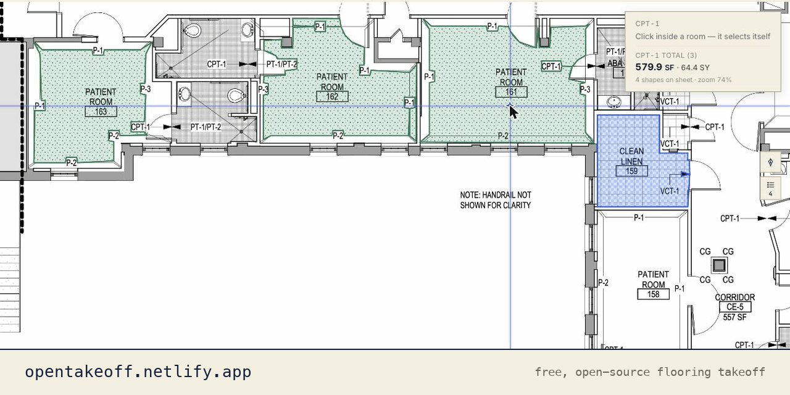
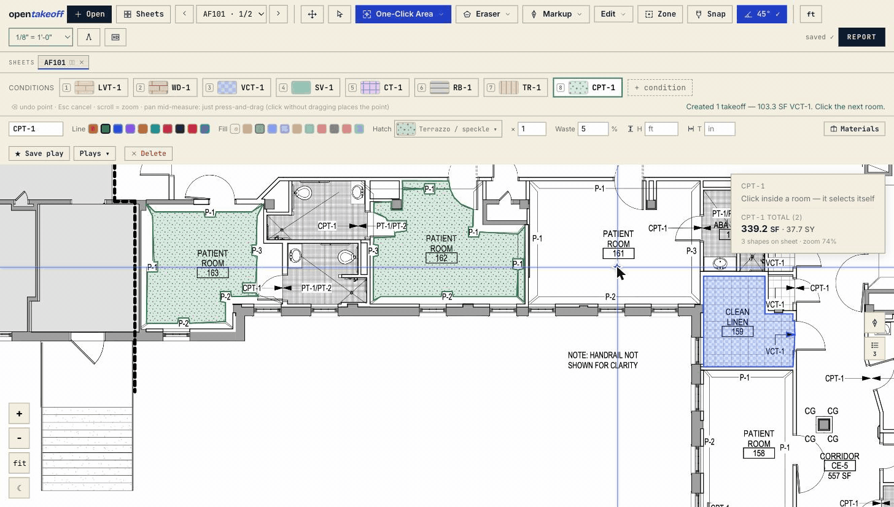
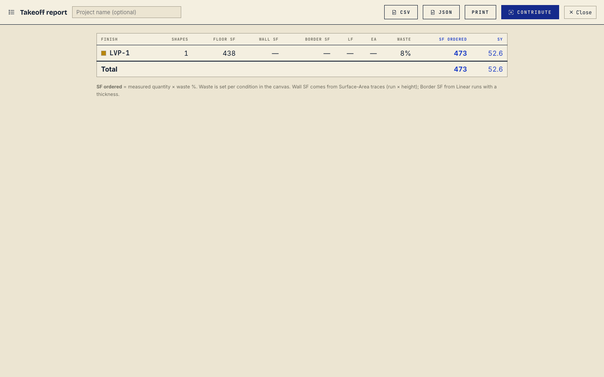

<div align="center">

# OpenTakeoff

**The free, open-source takeoff canvas for flooring — open a plan, trace your areas, export your quantities.**

Open the plan. Set the scale. Trace the rooms. Read the report. Export the quantities.
No account. No upload. No install. It runs in your browser.

[](LICENSE)
[](https://opentakeoff.netlify.app)
[](#tech-stack)

[**▶ Try the live demo**](https://opentakeoff.netlify.app) · [Quick start](#quick-start) · [Features](#features) · [Deploy it](#run-it--deploy-it) · [Own your data](#own-your-data--the-capture-layer) · [Build on top](#build-on-top-of-it) · [Contributing](CONTRIBUTING.md)

**New — July 2026:** One-Click Area now traces **hatched rooms** and **scanned plans** · **Dark view** (negative print) · **Marked Set PDF export** — [full changelog](CHANGELOG.md)

<br/>



</div>

---

Until now there has been **no open-source, web-based takeoff canvas at all** — let alone one built for flooring. OpenTakeoff is that tool: a free, open-source alternative, given to the trade.

It started as the takeoff module of a private flooring estimating app, then got carved out, cleaned up, and released. **This is the real measuring engine, not a demo** — including **One-Click Area**, the flood-fill room tracer the $300/mo tools gate behind a subscription.

**Built for flooring, useful for any takeoff.** The measuring engine is general — area, linear, count, and deduct work on anything you'd scale off a plan (drywall, paint, concrete, sitework). What makes it *flooring's* tool is the finish-aware layer on top: conditions with CAD hatches, per-condition waste %, square-yard output, and a coverage-rate **materials buy list** nobody else hands the trade for free.

And there's nothing to set up. Open the page, drag in a plan, start measuring. Your PDFs and your takeoffs never leave your machine — there is no server in the loop.

## Quick start

You don't need to install anything to *use* it — just open the [**live demo**](https://opentakeoff.netlify.app), drag in a plan, and go.

To run it yourself:

```bash
cd web
npm install
npm run dev        # http://localhost:5173
```

Drag **`demo/sample-plan.pdf`** onto the canvas. The scale auto-detects; pick a condition, hit **One-Click Area**, and click inside a room. Open **Report** to see the breakdown and export CSV / JSON.

## Features

### 1. Open anything, instantly
Drag in a plan **PDF**, an **image** (a scan or a screenshot), or a whole **`.zip` plan set** straight off a bid platform. Zips are unpacked and images wrapped to PDF *in your browser* — multi-page and multi-sheet, with up to **4 sheets side-by-side**. No upload step, no conversion service, no account.

### 2. A real measuring engine — not a counter with a ruler
**One-Click Area** is the headline: click inside a room and the linework bounds it, the polygon traces itself, and the vertices snap to true corners. It reads the drawing the way an estimator does — **hatching and poché don't fool it**: tile grids, plank lines, and section fills are classified as pattern, not wall, so a click inside a fully hatched room still traces the room (and a misread can never make the result worse than the strict fill — it escalates only when the strict pass comes back trapped). **Scanned plans work too**: when a sheet is a scan (no vector linework), the engine reads the rendered pixels instead — adaptive thresholding with a gap-bridging pass — and the same flood/trace machinery runs on the scan ink; the result is badged so you verify the edges before Create. Plus the full manual kit — **Area, Rectangle, Linear, Surface-Area (walls), Count,** and **Deduct** (for columns, voids, and openings). This is the same engine pulled out of a commercial estimating app, not a toy reimplementation.

<div align="center">

</div>

Manual tracing gets a real drafting aid: **45°/90° angle lock**. Come within a few degrees of square or diagonal and the segment you're drawing locks onto the axis — the click commits the locked point, so walls come out dead square (hold **⇧** to force the lock at any angle). On the canvas the crosshair **is** the cursor: the OS pointer hides, a star marks the crossing, and in-progress work draws in the instrument's own cobalt (committed shapes wear their condition color). The lock reads quietly — the star swells, the preview thickens, and a chip by the cursor shows the locked angle plus the **live segment length**. No extra chrome on your sheet.

### 3. Scale that matches real plan sets
Auto-detects the drawn scale note off the sheet, or **calibrate** from any known dimension (click two points, type the real length). Scale is remembered **per sheet** — because plan sets are never one uniform scale, and tools that assume they are get the numbers wrong.

### 4. Conditions that read like the drawing
A condition is one finish (LVP, carpet, tile, base, …). Each carries a **line/fill color** and a **CAD hatch pattern** (plank, herringbone, tile, terrazzo) so the canvas looks like the real drawing — plus a per-condition **waste %**, an **×N multiplier** for repeated identical units, a default **height** for wall traces, and a **thickness** that turns a linear run into border/feature-strip SF.

### 5. Assemblies — the supporting materials, done right
Per condition, list the consumables that actually go on the order: adhesive, sealer, polyurethane, thinset, grout, cove-base adhesive. Each has a **coverage rate** and a **basis** (floor SF / linear LF / each), and the order quantity derives automatically — measured ÷ coverage, **rounded up** to whole units. Adhesive and mortar lines get **coverage presets** (trowel notches, rollers) that fill the spread rate, and grout lines get a **calculator** that derives SF/bag from tile size, thickness, joint width, and bag weight. This is the layer most takeoff tools punt on. It's shipped here.

### 6. Reports & export
A per-condition breakdown — **Floor / Wall / Border SF, LF, EA, total SF, SY**, with and without waste — plus a combined **materials buy list**. Export to **CSV**, **JSON**, or a real **Excel workbook** (Summary, By-sheet, Materials, and Shapes-audit tabs — full-precision cells, formula-shaped names stay inert text), or print it. Waste is applied only in the report (the order quantity), never to the live measured number, so your takeoff and your buy list stay honest about which is which.

And when the numbers need to leave the app: **Marked Set PDF**. One click builds a distribution-ready PDF entirely in your browser — every sheet with the work burned in as drawn (condition colors, hatches, quantity chips, count markers, markups) behind a legend cover with the full totals and a by-sheet breakdown. Send it to a GC who will never install anything.

When the addendum lands: **Revisions**. Save the takeoff as a named revision at each bid revision, then compare any two — or a revision against the live takeoff — as **quantity deltas** per condition, per sheet, and on the buy list, with a compare CSV. Restore auto-banks the live takeoff first, so it's never a one-way door.

### 7. A vector-sharp canvas + plan-set tools
Zoom in and the linework stays **razor-sharp**: past ~1.15× the visible region re-renders straight from the PDF vectors at your current zoom — Bluebeam/AutoCAD-style — instead of magnifying a fixed bitmap, so fine callouts and hatching never blur. It overlays just what's on screen, so there's no giant full-sheet bitmap to hold. Plus a **dark view** (☾) that inverts the sheet itself — a true negative print, white linework on black, not a CSS filter — with hatches retuned so takeoffs read as well at night as they do at noon. And a visual **gallery** (`G`) to pick and open sheets, **Regroup** to restore a side-by-side composition in one click, per-sheet **Hi-Res** base rendering, **Snap** (beta) to plan lines and corners, and a separate **markup layer** (revision clouds, callouts, text notes) that's never counted in the totals.

### 8. Yours, locally
Every drawing, scale, condition, and markup autosaves to **your browser** (IndexedDB + localStorage). Nothing is uploaded, there's no account, and there's no server in the default build. Host the static build yourself and it stays exactly that way.

<div align="center">

</div>

## What's in the box

| Area | What you get |
|---|---|
| **Ingest** | PDF, image, or `.zip` plan set — unpacked in-browser, multi-page, up to 4 sheets side-by-side |
| **Scale** | Auto-detect the drawn scale note, or calibrate from a known dimension — per sheet |
| **Measure** | One-Click Area (flood-fill), Area, Rectangle, Linear, Surface-Area (walls), Count, Eraser (deduct), Zone check (per-region breakdown) — imperial or metric (m²/m, 1:50-style scales) |
| **Drawing aids** | 45°/90° angle lock with ⇧ hard-lock, live angle + segment-length readout at the cursor, endpoint Snap (beta) |
| **Conditions** | Color + CAD hatch per finish, waste %, ×N multiplier, height, thickness → border SF |
| **Assemblies** | Per-condition supporting materials with coverage rates → rounded order quantities, per-material coverage presets + grout calculator |
| **Report** | Per-condition Floor/Wall/Border SF, LF, EA, SY, with/without waste + materials buy list |
| **Export** | CSV, JSON, **Excel (.xlsx)**, print, **Marked Set PDF** (sheets + burned-in takeoff + legend cover, built in-browser) |
| **Revisions** | Save the takeoff at each bid revision, compare what moved — quantity deltas per condition, per sheet, and on the buy list; guarded restore |
| **Markups** | Revision clouds, callouts, text notes — separate layer, never counted |
| **View** | Light or **dark (negative print)** — sheet pixels inverted at draw time, persists per browser |
| **Storage** | IndexedDB + localStorage — client-only, nothing uploaded |
| **Capture (opt-in)** | Bundled [capture server](capture/README.md) banks each contributed takeoff as (geometry → label) training rows — a corpus you own, mirrorable to a synced company share |
| **MCP server** | The engine on stdio for your MCP client — load a plan, set the scale, one-click rooms, export the takeoff ([`mcp/`](mcp/README.md)) |
| **Deploy** | One static build, hostable on Netlify, Vercel, GitHub Pages, S3, or any static host |

## Run it / deploy it

**To use it, all you need is a browser.** To self-host, it's one static build you can drop anywhere — there's no backend, no database, no environment to stand up.

```bash
cd web
npm install
npm run build      # → web/dist/  (static; host it anywhere)
```

[](https://app.netlify.com/start/deploy?repository=https://github.com/Kentucky-ai/opentakeoff)

The repo ships a root `netlify.toml`, so the button above is genuinely one-click. The same `web/dist/` works on **Vercel, GitHub Pages, Cloudflare Pages, S3** — anywhere that serves static files.

## Own your data — the capture layer

Here's the part of a takeoff nobody talks about: every one you finish is a set of expert decisions — *this* region gets *this* finish, at *this* waste %, yielding *these* quantities. Done once, that's a bid. Banked every time, it's a **labeled dataset nobody else has** — the exact raw material for training a takeoff model on your trade and your market. Today that data evaporates the moment the bid goes out. It doesn't have to.

OpenTakeoff ships an optional **capture layer** so you can keep it:

- The **Contribute** button in the Report builds a derived-only payload — condition labels, shape roles, quantities, normalized geometry. Never the PDF, file names, project/client names, markups, or absolute coordinates. The builder is ~70 audited lines: [`web/src/lib/contribute.js`](web/src/lib/contribute.js).
- The bundled **capture server** ([`capture/`](capture/README.md)) — one stdlib-only Python file, no pip install — receives it on localhost and banks one training row per labeled shape, hash-gated so re-contributions never duplicate. Point it at a synced folder with `--mirror` and the corpus rides your existing OneDrive/SharePoint/Dropbox sync into company storage, atomically, ready to train on.

```bash
python3 capture/capture_server.py    # then, in the app's browser console:
# localStorage.opentakeoff_contribute_endpoint = "http://localhost:8787/contribute"
```

Run OpenTakeoff as-is and none of this exists for you — nothing is captured, nothing leaves your machine. Install it and every takeoff you *choose* to contribute compounds into an asset you own. This is the open edition of the capture layer inside [Spline](https://spline.quisutdeus.io), the commercial Division-9 estimating system OpenTakeoff was carved from, where capture runs far deeper — ambient on autosave and commit, no button: provisional rows bank while you draw, certified rows land on commit with the exploded materials assembly, edits carry a decision trail, and each job's corpus files itself into that GC's folder on the company share. The full pitch, the row schema, and the training angle live in [`capture/README.md`](capture/README.md).

## The research behind OpenTakeoff

OpenTakeoff is the open half of an applied-research program run by a working commercial flooring estimator ([Kentucky AI](https://kentucky-ai.com)). The boundary is deliberate, and it's the same one the best open-core scientific software draws: **the measurement engine — rendering, scale, geometry, exports, the MCP server — is Apache-2.0 and stays open. The AI models we train on our own estimating archive are proprietary.** You get a real tool with no seat licenses; we keep the part that only our data can build.

The research side runs like a lab, not a demo reel:

- **Markup-as-label training data (patent pending).** Every takeoff an estimator saves in professional takeoff software stores the drawn regions as vector geometry, and reconstructing those polygons reproduces the recorded quantities exactly. Two decades of estimating work is an exact, verifiable training corpus — that's the thesis the whole program tests.
- **Parameter-efficient tuning, not pretraining.** The models are QLoRA adapters on open-weights bases (~0.1% of parameters trained), specialized from a verified bid archive — cheap enough to retrain when the data says retrain, small enough to ship. The flagship adapter predicts bid totals at **12.3% median absolute percentage error on a 51-project temporal holdout**, against 62.8% for the untuned base — full method and honest caveats on the [model card](https://huggingface.co/Kentucky-ai/div9-flooring-estimator-gemma4-31b).
- **Verified labels in, verified rulers out.** Before any historical bid becomes training data it passes a dual-document verification gate: totals must reconcile between the bid workbook and the separately filed proposal, change orders only count when corroborated by an actual change-order document, and line-item arithmetic is recomputed and forensically checked. Unverifiable projects don't train.
- **Frozen holdouts and verifiable rulers.** Every model is scored against temporally held-out projects it never trained on — future bids, not a random split — with a geometry scorer whose own error floor is measured (0.4%), so we know when a number is model error versus measurement error.
- **Multi-seed replication.** No result is promoted from a single training run; promotion requires seed replication with paired bootstrap confidence intervals — and the cross-seed spread gets published, not just the best seed.
- **Negative results are kept.** The experiment ledger records what failed and why — an unfreeze recipe that destroyed detection, a vertical-specialist model that lost to the generalist's cross-vertical transfer — alongside what worked.
- **Leak-audited before release.** Identifiers are replaced *before* training (the weights never see a real name), and every public artifact passes a differential red-team: adversarial extraction probes against the tuned model with the untuned base as control.

Sanitized research artifacts — model cards, benchmark specs, papers — are published as they clear review: [Hugging Face](https://huggingface.co/Kentucky-ai) · [kentucky-ai.com](https://kentucky-ai.com).

## Bring your own AI (optional)

OpenTakeoff can ask a vision model **you** provide to read things off the plan — starting with the drawn scale when a sheet's text doesn't state one (scans, rotated notes, image title blocks). Click **AI** in the toolbar and point it at an **OpenAI-style** endpoint (the default — local runtimes on your own machine speak it and need no key) or an **Anthropic-style** endpoint, plus a vision-capable model id.

- **What's sent, and only when you click an AI button:** one snapshot of the sheet region in question, plus the question — to *your* endpoint. Never the whole plan file, file names, project names, or your takeoff.
- **Nothing configured = nothing exists.** Unconfigured builds add zero UI beyond the button and make zero AI network calls. No telemetry either way.
- The model's answer is only ever a **suggestion** — it lands in the same confirm-to-apply flow as the text-detected scale, and the calibrated guide bar shows on acceptance so you can sanity-check it.
- The key (if any) is stored in this browser's localStorage — use one you can revoke. Deployers: `VITE_AI_ENDPOINT` / `VITE_AI_MODEL` / `VITE_AI_PROVIDER` can bake defaults into a team build, but **never set `VITE_AI_KEY` on a public deploy** — Vite inlines it into the shipped bundle.

## Use it from an AI agent

The same engine speaks [MCP](https://modelcontextprotocol.io): [`mcp/`](mcp/README.md) is a stdio server your MCP client can drive, one command away — `npx -y opentakeoff-mcp` — with `load_plan`, `read_sheet_text`, `set_scale`, `one_click`, `takeoff_summary`, `export_takeoff` and friends. An agent opens a plan, reads the title block, adopts the scale (never applied silently), clicks the rooms, and exports the exact payload the app autosaves — same math, same provenance receipts, same scale gate. Setup and a full example transcript: [`docs/MCP.md`](docs/MCP.md).

## Build on top of it

OpenTakeoff is **Apache-2.0**: fork it, change it, ship it — for your own crew or as the base of your own product. The codebase is deliberately small and readable so you can add the features *you* want:

- **Geometry & measurement** — [`web/src/lib/oneclick.ts`](web/src/lib/oneclick.ts), [`web/src/lib/sheets.ts`](web/src/lib/sheets.ts) (typed and tested)
- **Totals & materials math** — [`web/src/lib/totals.js`](web/src/lib/totals.js)
- **State & persistence** — [`web/src/lib/store.js`](web/src/lib/store.js)
- **UI** — [`web/src/pages/TakeoffCanvas.jsx`](web/src/pages/TakeoffCanvas.jsx) and [`web/src/components/`](web/src/components/)

Run `npm run typecheck && npm test && npm run build` before a PR; keep the geometry libs pure and tested; never commit real plans. See [CONTRIBUTING.md](CONTRIBUTING.md) and the [user guide](docs/USER_GUIDE.md).

## Contributing — there's a ladder

Every open issue is a real need, not a manufactured chore, and there's a rung for wherever you're starting from:

- **First PR:** issues labeled [`good first issue`](https://github.com/Kentucky-ai/opentakeoff/labels/good%20first%20issue) are small, fully specified, and point at the exact files. Claim one in a comment and go.
- **The flagship:** [#29 — expose plan sheets as MCP resources](https://github.com/Kentucky-ai/opentakeoff/issues/29) is an open design-and-build challenge. Multiple entries welcome; the best one merges with credit in the release notes, and it ships to every client that pulls [`opentakeoff-mcp`](https://www.npmjs.com/package/opentakeoff-mcp) off npm.

Ground rules live in [CONTRIBUTING.md](CONTRIBUTING.md). Tested PRs with green CI merge fast — the last three external PRs did.

## Tech stack

- **Frontend:** React 18 + Vite, plain JSX
- **Drawing:** raw HTML5 Canvas + SVG (no charting/canvas frameworks)
- **Geometry:** TypeScript (`oneclick.ts`, `sheets.ts`)
- **PDF rendering:** [pdf.js](https://github.com/mozilla/pdf.js)
- **Plan-set ingest:** fflate (zip) + pdf-lib (image → PDF), lazy-loaded
- **Storage:** IndexedDB + localStorage — no backend required
- **Tests:** `node --test` + `tsx`
- **No paid dependencies.** See [THIRD-PARTY-NOTICES.md](THIRD-PARTY-NOTICES.md).

## Status

OpenTakeoff is a **working tool**, not a preview. The measuring engine — One-Click Area, conditions, assemblies, the report and exports — is the production engine carved out of a commercial flooring estimating app. **Snap** is marked beta. It's used on real commercial flooring bids; issues and pull requests are welcome.

## A note from the maker

I run estimating for a commercial flooring company. Every takeoff tool I've used costs four figures a year  — so I built the one I actually wanted, and I'm giving it to the trade.

This is the real measuring engine, not a teaser. **One-Click Area** is the same flood-fill room tracer the expensive tools gate behind a subscription. Open a plan, trace your rooms, hand off a clean report — free, and nothing ever leaves your computer.

— Michael · Kentucky Ai

## License

[Apache License 2.0](LICENSE) — use it, fork it, ship it, build on top of it. Given to the flooring community. See [NOTICE](NOTICE) for attribution.
