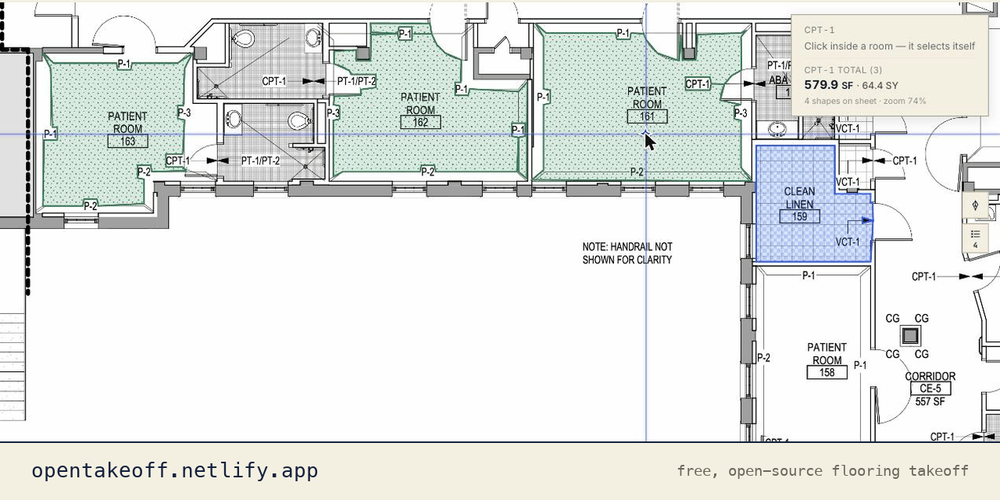

<div align="center">

# OpenTakeoff

**第一个同时为人和 AI 智能体打造的算量画布。**

打开一张建筑图纸就能测量 —— 你可以自己描房间，也可以让 AI 智能体驱动**同一个引擎**。
每一个测量值都带着它的**比例**和**它是怎么得到的**。免费、开源、在浏览器里运行 ——
无需账号，无需上传，无需安装。

[](LICENSE)
[](https://opentakeoff.kentucky-ai.com)
[](#技术栈)

[**▶ 打开在线演示**](https://opentakeoff.kentucky-ai.com) · [快速开始](#快速开始) · [功能](#主要功能) · [给 AI 智能体](mcp/) · [English](README.md) · [日本語](README.ja.md) · [한국어](README.ko.md)

<br/>



</div>

---

OpenTakeoff 是一个免费开源的画布，用来从建筑图纸上量取工程量 —— 也就是**算量**（takeoff）。
它的不同之处在于「谁能驱动它」：人**或者** AI 智能体，跑的是**同一个引擎**。你在房间内部点一下，
轮廓就自己描出来了；智能体通过 [MCP](mcp/) 调用同一个工具，拿到同一个数字。而且每个测量值都
记录着**它是怎么产生的** —— 比例是多少、是一键生成还是手动描的、是人画的还是智能体画的。
依据跟着数字一起走。

在此之前，**根本不存在基于网页的开源算量画布** —— 面向楼地面装修的就更不用说了。
OpenTakeoff 就是这个工具：一个免费开源的替代品，交给这个行业。

它最初是一个商用楼地面装修预算软件里的算量模块，后来被剥离出来、整理干净、开源发布。
**这是真正的测量引擎，不是演示版** —— 包括 **One-Click Area**，也就是那些每月 $300 的
工具锁在订阅后面的漫水填充式房间识别器。

### 支持公制

可以直接用在国内图纸上。原生支持 **m² / m 单位**和 **1:50、1:100 这类比例尺**，并且比例是
**按图纸单张记忆的**（因为一套图纸的比例几乎从来不是全套统一的，而假定统一的工具会把数算错）。
也可以随时切换到英制。

### 但界面目前只有英文

先说清楚：测量、数字和导出都跟语言无关，但工具栏和菜单的文字目前只有英文，界面还没有翻译层。
读图算量本身完全没问题，只是按钮上的字是英文的。如果你需要中文界面，
[提个 issue 告诉我们](https://github.com/Kentucky-ai/opentakeoff/issues) —— 看到有需求就会做。

## 快速开始

只是想用的话，什么都不用装 —— 打开[**在线演示**](https://opentakeoff.kentucky-ai.com)，
把图纸拖进去就行。

想自己跑：

```bash
cd web
npm install
npm run dev        # http://localhost:5173
```

把 **`demo/sample-plan.pdf`** 拖到画布上。比例会自动识别。选一个做法（condition），
点 **One-Click Area**，然后在房间内部点一下。打开 **Report** 就能看到明细，
并导出 CSV / JSON。

## 主要功能

| 方面 | 内容 |
|---|---|
| **导入** | PDF、图片、或整包 `.zip` 图纸 —— 在浏览器内解包，支持多页，最多 4 张图纸并排 |
| **比例** | 自动识别图纸上标注的比例，或用已知尺寸标定 —— 按单张图纸分别保存 |
| **测量** | One-Click Area（漫水填充）、面积、矩形、长度、墙面面积、计数、扣减（deduct）、分区核对 —— 公制／英制 |
| **绘图辅助** | 45°／90° 角度锁定（按 ⇧ 强制锁定）、光标处实时显示角度和线段长度、端点吸附（beta） |
| **做法（condition）** | 每种面层的颜色 + CAD 填充图案、损耗率、×N 倍数、墙面高度、宽度 → 折算踢脚／分隔条面积 |
| **辅材** | 每种做法的施工工艺和基层类型，以及胶粘剂、封闭底漆、聚氨酯、薄贴砂浆、填缝剂等辅材 —— 按覆盖率（用量）自动折算成采购数量（向上取整） |
| **报表** | 按做法分列的地面／墙面／踢脚面积、长度、个数，含损耗与不含损耗 + 材料采购清单 |
| **导出** | CSV、JSON、**Excel（.xlsx）**、打印、**标记版 PDF**（图纸 + 已绘制的算量 + 图例封面，全部在浏览器内生成） |
| **版本管理** | 每次投标修改都保存一版，然后比对差异 —— 按做法、按图纸、按采购清单列出数量增减 |
| **批注** | 云线、引注、文字说明 —— 独立图层，绝不计入工程量 |
| **显示** | 浅色／**深色（负片）** —— 在绘制时反转图纸像素本身，而不是加一层 CSS 滤镜 |
| **存储** | IndexedDB + localStorage —— 完全在客户端，不上传 |
| **MCP 服务器** | 通过 stdio 让 MCP 客户端驱动引擎 —— 载入图纸、设置比例、一键点房间、导出算量结果（[`mcp/`](mcp/README.md)） |
| **来源记录** | 每个图形都记录它是怎么测出来的 —— 比例、一键还是手绘、人还是智能体 |
| **部署** | 一个静态构建产物，可托管在 Netlify、Vercel、GitHub Pages、S3 或任何静态主机 |

## 从 AI 智能体调用

同一个引擎会说 [MCP](https://modelcontextprotocol.io)。[`mcp/`](mcp/README.md) 是一个
MCP 客户端可以驱动的 stdio 服务器，一条命令就能跑 —— `npx -y opentakeoff-mcp`，
提供 `load_plan`、`read_sheet_text`、`set_scale`、`one_click`、`view_sheet`、
`takeoff_summary`、`export_takeoff` 等工具。

智能体会打开图纸、读图签栏、采用比例（绝不会被静默套用）、点选房间、用带标定测量网格的
渲染图（`view_sheet`）复核自己的工作，然后导出与应用自动保存完全一致的数据 —— 同样的算法、
同样的来源记录、同样的比例校验。配置方法和一份完整的对话示例见 [`docs/MCP.md`](docs/MCP.md)。

## 数据是你自己的

所有图纸、比例、做法和批注都自动保存在**你自己的浏览器**里（IndexedDB + localStorage）。
不上传、无账号，默认构建里根本没有服务器。你把静态产物自己托管，它就一直是这个状态。
即使使用语音输入，语音识别也是在浏览器本地完成的，音频不会离开你的机器。

## 背后的研究

OpenTakeoff 是一个应用研究项目（[Kentucky AI](https://kentucky-ai.com)）中开放的那一半 ——
这个项目由一位在职的商业楼地面装修预算员运营，他自己造他部门在用的 AI。这条边界是刻意划的，
和优秀的开放内核科学软件划的是同一条线：**测量引擎（渲染、比例、几何、导出、MCP 服务器）
以 Apache-2.0 开源并持续开放；用我们自己的预算档案训练出来的 AI 模型是专有的。**
你得到一个不收席位费的真工具，我们保留只有我们的数据才能造出来的那部分。

已公开的研究产物（模型卡、基准规范、论文）：
[Hugging Face](https://huggingface.co/Kentucky-ai) · [kentucky-ai.com](https://kentucky-ai.com)

## 在它之上构建

OpenTakeoff 采用 **Apache-2.0**：随便 fork、修改、发布 —— 给自己团队用，或者作为你自己
产品的底座。代码库刻意保持得小而好读：

- **几何与测量** —— [`web/src/lib/oneclick.ts`](web/src/lib/oneclick.ts)、[`web/src/lib/sheets.ts`](web/src/lib/sheets.ts)（有类型、有测试）
- **汇总与材料计算** —— [`web/src/lib/totals.js`](web/src/lib/totals.js)
- **状态与持久化** —— [`web/src/lib/store.js`](web/src/lib/store.js)
- **界面** —— [`web/src/pages/TakeoffCanvas.jsx`](web/src/pages/TakeoffCanvas.jsx)、[`web/src/components/`](web/src/components/)

提 PR 之前请跑 `npm run typecheck && npm test && npm run build`；几何库要保持纯函数并带测试；
永远不要提交真实工程图纸。详见 [CONTRIBUTING.md](CONTRIBUTING.md) 和[用户手册](docs/USER_GUIDE.md)。

**欢迎贡献。** Issue 和 PR 用中文写完全没问题 —— 我们会翻译后处理。带
[`good first issue`](https://github.com/Kentucky-ai/opentakeoff/labels/good%20first%20issue)
标签的 issue 都很小、说明完整，而且直接指到了对应文件。有测试、CI 是绿的 PR 会很快合并。

## 技术栈

- **前端：** React 18 + Vite（纯 JSX）
- **绘制：** 原生 HTML5 Canvas + SVG（不用任何绘图框架）
- **几何：** TypeScript（`oneclick.ts`、`sheets.ts`）
- **PDF 渲染：** [pdf.js](https://github.com/mozilla/pdf.js)
- **图纸导入：** fflate（zip）+ pdf-lib（图片 → PDF），按需懒加载
- **存储：** IndexedDB + localStorage —— 不需要后端
- **测试：** `node --test` + `tsx`
- **没有任何付费依赖。** 详见 [THIRD-PARTY-NOTICES.md](THIRD-PARTY-NOTICES.md)。

## 状态

OpenTakeoff 是一个**在用的工具**，不是预览版。测量引擎 —— One-Click Area、做法、辅材、
报表和导出 —— 就是从一个商用楼地面装修预算软件里剥出来的生产版引擎。**Snap** 标注为 beta。
它被用在真实的商业楼地面装修投标上。

## 许可证

[Apache License 2.0](LICENSE) —— 拿去用、fork、发布、在它之上构建。
署名要求见 [NOTICE](NOTICE)。

---

> **关于这份中文版。** 以英文版 [README.md](README.md) 为准。这份翻译是精简版，新功能同步到
> 这里会有延迟；两边不一致时以英文版为准。完整功能清单见 [FEATURES.md](FEATURES.md)，
> 更新记录见 [CHANGELOG.md](CHANGELOG.md)。发现翻译错误的话，欢迎提 issue 或 PR 指出来。
