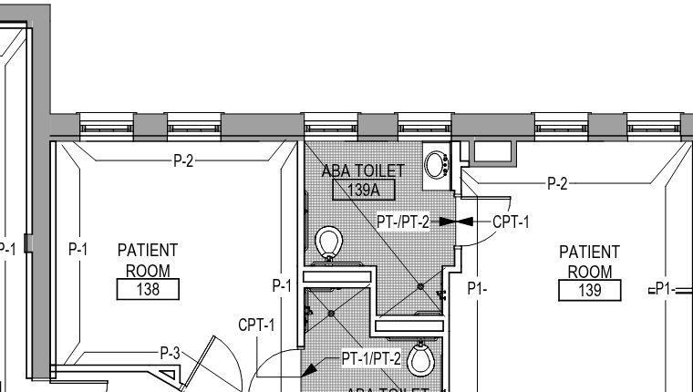

# Client-side OCR for a search + symbol index — research

**Status:** research + a measured spike. No app code, no commitment.
Written 2026-07-28; §9 adds real tesseract.js numbers on the sample plan.
**Question:** can OpenTakeoff build a plan-set **search index** and a **symbol
index** entirely in the browser — no server, no upload — and where does OCR
actually fit?

**Short answer:** yes for search, and OCR is a *small* part of it. On a vector
plan the app already extracts every token it needs and throws them away; the
index is nearly free and needs no OCR at all. OCR only buys you the ~30% of
intake that arrives as scans, it costs ~5 MB of lazily-loaded WASM, and it is
the *least* certain part of the value. The symbol index is a genuinely harder
problem and does not reduce to OCR.

Recommendation in one line: **build the search index off the existing text
layer first; add self-hosted tesseract.js as an opt-in per-sheet fallback for
scans; treat the symbol index as a separate, later, vector-first investigation.**

---

## 1. What the app already has (measured, not assumed)

This matters more than any engine comparison, because it changes what OCR is
*for*.

| Capability | Where | Note |
|---|---|---|
| Per-page positioned text | `TakeoffCanvas.jsx` render effect | `getTextContent()` per page |
| **A full-document text pass already runs** | `TakeoffCanvas.jsx`, the `labeledFileRef` block in the render effect | loops every page of the active PDF, extracts sheet number + scale, and (before this work) **discarded the rest** |
| Title-block sheet number | `sheets.ts` `extractSheetNumber` | lower-right heuristic + regex |
| Drawn-scale note parsing | `sheets.ts` `detectScale` | title-block-first, page-wide fallback |
| Positioned tokens in a rect | `sheets.ts` `extractRegionText` | already returns `{str, x, y, h}` — the exact shape an index wants |
| Room-label detection from text | `detectRooms.ts` `roomLabelSeeds` | `/^\d{2,3}[A-Z]?$/` |
| Vector op-list walk incl. Form XObjects | `oneclick.ts` `extractVectorGeometry` | pushes/pops the form matrix around `paintFormXObjectBegin`/`End` |
| Raster/vector discrimination | `oneclick.ts` → `sheetStatsRef` (`TakeoffCanvas.jsx`), `rastermask.ts` | `segCount` + `imageFrac` — **this is already the "is this a scan?" oracle** |
| Raster binarization (adaptive threshold, deskew-free) | `rastermask.ts` | ~~ready-made OCR preprocessing~~ — **§9 measured this: not reusable as-is, its 135 px window destroys 19 px text** |
| Per-sheet cache refs, thumbnail cache | `snapGridsRef`, `thumbCacheRef` | the place an index would live |
| IndexedDB persistence | `store.js` (`opentakeoff`, v2, stores `pdfs`/`meta`/`snapshots`) | where an index would persist |

**The single most important finding:** the per-file label pass in `TakeoffCanvas.jsx` already
walks *every page* of the active PDF and calls `getTextContent()` on each, purely
to find sheet numbers and scale notes. It then drops the text. A search index over
a vector plan set costs **one extra function call inside a loop that already
runs** — no new I/O, no new PDF parsing, no OCR.

**Measured on the bundled sample** (`demo/sample-finish-plan.pdf`, 1.18 MB):
~1,047 text-show operators on the sheet, 6 image XObjects, **0 Form XObjects**,
6.2 MB of decompressed content streams. So order-of-magnitude ~1k tokens per
sheet ⇒ a 200-sheet set is ~200k tokens — trivially in-memory for any JS search
library. (The zero Form XObjects is a caveat for §5, not for search. Note this
file is a REAL CAD-plotted VA drawing — see §9 — so "no Form XObjects" is a data
point about real plots, not an artifact of a synthetic fixture. The repo's other
demo asset, `demo/sample-plan.pdf`, IS script-generated; this is not that file.)

## 2. Prior art in this repo — and why this is not a re-run of it

- **#129 "Batch detect: raster/OCR seeding for scanned plans"** — closed
  `not_planned` on 2026-07-21. It proposed OCR as a *seeding oracle* for the
  room-flood pipeline, via a **login-gated server endpoint**. It died with the
  #81 batch-room-detection roadmap ("deterministic detection capped; learned-path
  foundation not being built right now").
- **#80 / `scheduleScan.ts`** — the one shipping OCR path is server-side and
  BYO-model: `POST /ai/parse-schedule` → Gemini, gated on `GEMINI_API_KEY`,
  dormant on a default deploy. `sheets.ts:162-163` explicitly documents the
  vector path as "no OCR needed" with a fallback to that server call.

Search/symbol index is a **different proposition** from #129 on three axes, and
that's the case for looking again:

1. It doesn't touch the retired flood pipeline. Failure mode is "a sheet is
   missing from search results", not "a bad polygon got proposed".
2. It's **client-side**, so it doesn't need the login gate that made #129 a
   product problem. It preserves the "your PDFs never leave your machine" claim,
   which is a headline promise in `README.md`.
3. Accuracy tolerance is far higher. A takeoff geometry oracle must be near-exact;
   a search index tolerates ~85% recall and stays useful — a wrong hit costs one
   click.

## 3. Where OCR is actually needed

| Sheet class | Text source | OCR needed? |
|---|---|---|
| CAD-plotted vector PDF (majority) | pdf.js text layer | **No** |
| Vector wrapper around a scan image | none | Yes |
| Pure scanned PDF / photographed plan / image-in-zip (~30% of intake per #129) | none | Yes |
| Vector sheet with a raster detail inset | partial | Optional, low value |
| Text plotted as vector strokes (some plotters "explode" text) | none | Yes — and this is a silent failure today |

The trigger already exists and is already computed per sheet: `sheetStatsRef`'s
`{segCount, imageFrac}` versus `RASTER_MIN_IMG_FRAC = 0.10` /
`RASTER_MIN_SEGS = 500` (`rastermask.ts`). No new detection work.

Note the honest framing: **OCR is the fallback branch, not the feature.** If the
search index shipped vector-only it would still cover the majority of plan sets.

## 4. Engine options — hard numbers

All sizes are real, pulled from the npm registry / jsDelivr on 2026-07-28.

### 4.1 tesseract.js

- `tesseract.js@7.0.0` (2025-12-15), **Apache-2.0** — license-compatible with
  this repo without qualification.
- `tesseract.js-core@7.0.0`: `tesseract-core-simd-lstm.wasm` = **2.86 MB**
  (LSTM-only + SIMD; the full non-LSTM build is 3.45 MB).
- English `tessdata` (`4.0.0_fast`) = **1.98 MB** gzipped. (Standard = 10.9 MB,
  `best` = 12.8 MB — `fast` is the only sane choice for a web app.)
- **Total lazy payload ≈ 4.9 MB**, fetched once. `tesseract.js` already depends
  on `idb-keyval`, so the traineddata caches in IndexedDB — matching this repo's
  offline-first posture.
- Runs in a Web Worker; supports worker pools/schedulers for multi-sheet
  parallelism.
- Word-level bounding boxes + confidence are available, but **v6 disabled all
  non-`text` outputs by default** — you must explicitly opt into `blocks` to get
  boxes. Boxes are mandatory here (a search hit must zoom to a location), so
  budget for that config.
- `PSM 11/12` (sparse text) is the correct mode for plans, not the default
  `PSM 3` full-page assumption.

**Alternative:** `tesseract-wasm` (BSD-2-Clause, ~2.1 MB Brotli incl. English
data, SIMD, built-in worker) is leaner but a much smaller project with a thinner
API surface. Worth a look if the 4.9 MB matters; not the default pick.

### 4.2 PaddleOCR / PP-OCR via ONNX Runtime Web

Meaningfully more accurate on dense small text, and WebGPU-capable. But:

- `onnxruntime-web@1.27.0` WASM artifacts: `ort-wasm-simd-threaded.wasm` =
  **13.48 MB**; the WebGPU/JSEP build is **26.83 MB**.
- `@paddleocr/paddleocr-js@0.4.2` (Apache-2.0) is 23.8 MB unpacked and pulls in
  `@techstark/opencv-js` + `clipper-lib` + `onnxruntime-web`.
- `ppu-paddle-ocr@6.2.0` (MIT, 2026-07-22) is the leaner wrapper — package is
  only 242 KB, models fetched separately: PP-OCRv6 **tiny ≈ 6 MB**, small ≈ 30 MB,
  medium ≈ 139 MB. Reported ~140 ms median per box on an M1.
- Realistic total: **~20 MB (WASM) to ~33 MB (WebGPU)** of assets.

**The blocker is not size — it's cross-origin isolation.** Multithreaded ORT
WASM needs `SharedArrayBuffer`, which needs `crossOriginIsolated`, which needs
`COOP: same-origin` + `COEP: require-corp`. This app signs in with Google
Identity Services via a popup + `frame-src https://accounts.google.com`
(`web/public/_headers`). `COOP: same-origin` **nulls the popup's `window.opener`
and silently breaks OAuth token postback**; the documented fix is
`same-origin-allow-popups`, which explicitly does *not* grant cross-origin
isolation. So threaded PP-OCR and Google sign-in/Drive cloud mode are mutually
exclusive on this deploy unless sign-in migrates to FedCM first.

Single-threaded ORT avoids the header conflict at a large speed cost, which
erodes most of Paddle's reason to exist here.

### 4.3 Ruled out

- **Scribe.js** (`scribe.js-ocr@0.14.1`) — better OCR *and* native PDF support,
  but **AGPL-3.0**. That would relicense a distributed browser app. Hard no for
  an Apache-2.0 project.
- **Any server/VLM OCR** — reintroduces exactly the login gate and upload step
  that #129 died on, and contradicts the README's "no server in the loop".

### 4.4 Emerging options — checked 2026-07-28

The browser-ML landscape moves fast, so this is the "is tesseract.js about to be
obsolete?" pass. **Verdict: no. Nothing here displaces it for this use case
today** — but two are worth tracking, and the fact that steps 1–2 in §8 need no
OCR at all means the engine decision can be deferred cheaply.

**`ocrs` — the most interesting one, not ready.** Rust OCR engine by the author
of `tesseract-wasm`, Apache-2.0/MIT, running its own `RTen` inference engine
rather than ONNX Runtime. Philosophically the right successor: ML-based
throughout, explicitly designed to need "zero or much less preprocessing effort
compared to earlier engines like Tesseract", and its detection model
post-processes text-pixel clusters into **oriented** word bounding boxes — which
is exactly the rotated-text weakness this app would hit on plans (§7.1). But:

- **No npm package and no published browser build.** WASM is a stated goal
  ("easy to compile and run across a variety of platforms, including
  WebAssembly"), not a shipped artifact. You would build and maintain the WASM
  bundle yourself.
- **Models are 12.2 MB** (2.5 MB detection + 9.7 MB recognition, `.rten`) —
  ~2.5× the tesseract.js payload, so it isn't a size win either.
- Engine crate is alive (`ocrs@0.12.2`, 2026-03-27), but the **published models
  have not been updated since 2024-01-30**, and the README still says "currently
  in an early preview. Expect more errors than commercial OCR engines."
- Latin-only.

Watch it; revisit if a browser package lands.

**PP-OCRv6** — genuinely newer models than the v5 generation (`ppu-paddle-ocr`
shipped 2026-07-22, tiny ≈ 6 MB). Doesn't change the §4.2 verdict: the cost is
the ORT-web runtime (13.5–26.8 MB) and the COOP/Google-sign-in conflict, neither
of which a better model fixes.

**transformers.js v4** (`@huggingface/transformers@4.2.0`, 2026-04-22,
Apache-2.0) — real runtime progress, including a new C++ WebGPU backend. The
blocker is the model catalogue, not the runtime: the transformers.js-compatible
image-to-text models are dominated by TrOCR variants, which are **line
recognition only with no text detector** — on a plan sheet you'd still have to
build detection yourself. Florence-2 / SmolVLM / SmolDocling / GOT-OCR are not
in the browser-ready ONNX set. Not a path today.

**Chrome built-in AI (Prompt API / Gemini Nano, multimodal)** — the tempting
one, because the bundle cost is *zero*: the model ships with the browser and
does OCR-ish work on-device from Chrome 138+. Three reasons it's wrong here, the
third decisive:

1. ~4 GB first-use model download and ~20 GB disk.
2. Chromium-only — no Safari/Firefox story, and this app has no other
   browser-gated feature.
3. **It's generative.** This is a takeoff tool whose headline promise is that
   every measurement records how it was made. A hallucinating model silently
   populating a search index is a provenance problem, not just an accuracy one.
   Defensible at most as an opt-in, badged enrichment — never as the index's
   source of truth.

**WebNN** — W3C Candidate Recommendation updated 2026-01-22, Chrome 146 origin
trial. Chromium-only, explicitly not production-ready. Watch only; it changes
the *runtime* story for §4.2-style models, not the model story.

### 4.5 CSP impact (either engine)

`web/public/_headers` is already close to ready — `'wasm-unsafe-eval'` and
`worker-src 'self' blob:` are both present and documented. But
`script-src 'self'` means **CDN loading is blocked**: tesseract.js's default
`workerPath`/`corePath` point at unpkg/jsDelivr and would fail. Everything must
be self-hosted and `workerPath`/`corePath`/`langPath` set to same-origin paths.
`connect-src *` means the traineddata fetch itself would pass either way, but
self-hosting is the right call regardless — it keeps the offline promise real.
**Expected `_headers` diff: none.** That's a good sign.

## 5. The symbol index — the harder half

"Symbol index" and "search index" get bundled together in the ask, but they are
different problems and OCR solves neither of them well. Three tiers, cheapest
first:

### Tier 1 — text-layer tags (free, works today)

Most of what an estimator calls a "symbol" on a finish plan is *text*: room
numbers, finish tags (`CPT-1`, `LVT-3`), door tags, keynote bubbles. The repo
already proves this — `roomLabelSeeds` reads room numbers straight off the text
layer, and `scheduleParse.ts` already clusters positioned tokens into rows.
A tag index is the same machinery with a different regex. **This is where the
value/effort ratio is best and it needs no new dependency at all.**

### Tier 2 — vector geometry signatures (promising, unvalidated)

`extractVectorGeometry` already walks the op list and already brackets
`paintFormXObjectBegin`/`End` (`oneclick.ts:135-136`). A repeated CAD block
plotted as a Form XObject is the *same* form painted at N transforms — that is
an exact, deterministic symbol count with zero ML.

Two honest caveats, both verified:

- **pdf.js does not give you the XObject's identity.** Confirmed against
  `mozilla/pdf.js` `src/core/evaluator.js`: `paintFormXObjectBegin` is added with
  `args = [f32matrix, bbox|null]` — no name, no object id. So you'd have to
  *hash the geometry emitted between Begin/End in the form's local space* to get
  a signature. Doable, and arguably better (it also catches symbols drawn inline
  rather than as XObjects), but it's real work and it's a guess until measured.
- **Plotters vary.** The bundled sample plan has **0 Form XObjects**. Many CAD
  plot drivers flatten blocks into raw path streams, in which case the signature
  has to come from clustering connected components of the segments
  `extractVectorGeometry` already emits — same idea, more failure modes.

No prior art surfaced for this specific approach in a JS/pdf.js context, which
is either an opportunity or a warning. **It needs a measurement pass over 5–10
real CAD-plotted plan sets before anyone estimates it.**

### Tier 3 — learned / template matching on pixels

Template matching (OpenCV.js) or a small detector via ONNX. The literature is
clear that symbol detection in engineering drawings is an active research problem
— symbols appear at multiple scales and rotations, and the standard complaint is
that deep methods need per-class training data that is hard to obtain
(confidentiality, annotation cost). Few-shot template-matching approaches exist
but are recent research, not shipping libraries.

**Assessment: out of scope.** This is exactly the "learned path" whose
foundation #81 declined to build. Nothing here changes that verdict, and a
symbol *index* does not require it — Tiers 1 and 2 cover the realistic ask.

## 6. Search index — architecture

### Storage and shape

Per sheet, persist alongside the existing annotations in IndexedDB (`meta` store,
new key — no DB version bump needed, the store is keyPath-less, same pattern as
`TPL_KEY`/`MATLIB_KEY`/`STAMPLIB_KEY` in `store.js`):

```
{ sheetKey, source: "text" | "ocr", builtAt, tokens: [{ str, x, y, h, conf? }] }
```

`x/y/h` in image px at `RENDER_SCALE` — the same space `extractRegionText`
already returns and the same space One-Click seeds in, so a search hit can zoom
the canvas with no new coordinate math. `source` is the provenance flag; an
OCR-derived hit should be badged in the UI exactly the way scanned One-Click
results already are.

### Library

- **MiniSearch 7.2.0** (MIT, zero deps, 826 KB unpacked) — the fit. In-memory,
  prefix + fuzzy, small. At ~200k tokens for a large plan set this is not
  stressed.
- FlexSearch 0.8.x (Apache-2.0) is faster at much larger scale; that scale
  doesn't exist here.
- Fuse.js is fuzzy-only, no real inverted index — wrong tool.
- Honestly: for ~1k tokens/sheet, **a hand-rolled inverted index over normalized
  tokens is ~50 lines** and adds zero dependencies. Given this repo's dependency
  discipline (6 runtime deps total in `web/package.json`), that deserves serious
  consideration before adding MiniSearch.

### Where it hooks in

The per-file label loop in `TakeoffCanvas.jsx` — which already visits every page. Add the
token capture there; it is a handful of lines in the hot file, which matters
because of #166's constraint that `TakeoffCanvas.jsx` conflicts on nearly every
upstream sync. Keep all the actual logic in a new pure, DOM-free, pdfjs-free
`lib/planIndex.ts` (the `sheets.ts` / `oneclick.ts` / `detectRooms.ts`
precedent), so it is node-testable under `web/test/` and the hot-file diff stays
minimal.

### OCR as opt-in, per sheet

Do **not** auto-OCR a plan set. 4.9 MB download + seconds per sheet is not
something to spend on a user's behalf. The right shape, matching the existing
`canvasBusy.ts` "scanning" state and the badge-then-verify pattern the raster
One-Click already uses:

- Index vector sheets silently and for free.
- A scan-classified sheet (`imageFrac ≥ 0.10 && segCount < 500`) shows up as
  "not searchable — scan" with an explicit **Make searchable** action.
- That action lazy-loads the engine, OCRs at the existing mask scale using
  `rastermask.ts`'s binarization as preprocessing, and writes an index entry
  with `source: "ocr"`.
- Results from OCR are badged, never silently equated with text-layer results.

## 7. Risks and open questions

1. ~~**Rotated text.**~~ **MEASURED (§9)** — real, and worse than feared under
   PSM 11 (17% recall over the 69 WORDS in the sheet's 32 rotated text items —
   the scores are word-based; the item count is not the denominator) but fixable: PSM 3's
   layout analysis gets 81%, at 7.5× the runtime. The text layer still handles
   rotation for free.
2. ~~**Sheet size vs. OCR cost.**~~ **MEASURED (§9)** — the sheet is 26.1 MP at
   144 DPI and takes 19.2 s whole / 11.6 s tiled. Tiling helps speed, not
   accuracy. Rendering at 288 DPI made accuracy *worse*, not better.
3. **Form XObject prevalence is unknown.** §5 Tier 2 rests on it. Sample of one
   (the demo plan) says zero. Needs real plan sets.
4. ~~**Index invalidation.**~~ **HANDLED, and it bit twice.** `store.addPdf`
   keys IndexedDB on the file NAME, so a reissued `A101.pdf` replaces the bytes
   under the same sheet key — `dropFileFromIndex()` now runs on add, close, and
   remove-from-project, and `ensureIndexed` carries the pump's `seqRef` guard so
   a close mid-pass can't resurrect an entry. The second bite was subtler and
   only showed up in the browser: dropping the entries wasn't enough, because
   `hits` was memoized on signals that a *removal* never changes, so the gallery
   served a cached result and rendered "1 OF 0 SHEETS MATCH" over an empty
   project. Results are now intersected with the live plan set, which makes a
   hit naming a missing sheet structurally impossible rather than merely tidy.
5. **#166 plugin seam.** A 4.9 MB OCR engine is close to the archetypal
   "opt-in feature that shouldn't ship in core". If the plugin seam lands first,
   OCR is a natural first tenant. If it doesn't, the lazy `import()` pattern
   already used for the Google/Drive modules (`main.jsx:107-128`) is sufficient
   — the engine must never appear in the anonymous entry bundle.
6. **Upstream divergence.** This fork is `upstream-read-only` with ~676 lines of
   divergence. A search index is a plausible upstream contribution; a symbol
   index is more speculative. Worth deciding intent before building.

## 8. Suggested sequencing

Each step is independently shippable and each one is useful without the next.

1. ~~**Vector search index.**~~ **SHIPPED** — `web/src/lib/planIndex.ts`
   (pure, 33 node tests), capture in both text passes that already run (the
   canvas' full-document loop and `PlanNavigator`'s thumbnail pump), plus an
   on-demand pass for sheets neither has reached, and a search box in
   `PlanNavigator` that filters the gallery in relevance order. No new
   dependency, no OCR, no CSP change.
   §6's persistence has since shipped too: the index is serialized to the meta
   store under `planindex:<project>`, sanitized on load (the `sanitizeTemplates`
   precedent) and revalidated against the current plan set, so a stored index can
   never resurrect a sheet the project no longer has.
2. ~~**Tag index (symbol Tier 1).**~~ **SHIPPED** — `sheetCodes()` aggregated
   across the set behind a "Finishes" toggle in the gallery: every finish code
   the set uses, with per-tag sheet counts, click to search. This is the half
   search alone cannot do, since a search only helps once you can guess the code.
   Room numbers are counted but not yet listed (a 300-room set needs grouping
   the tag strip doesn't have).
3. **Measurement spike — no code shipped.** Two questions, both cheap:
   (a) ~~run tesseract.js over real sheets and record wall-clock, accuracy, and
   whether tiling is needed~~ — **done, see §9**; still worth repeating on
   genuinely scanned sheets rather than a rasterized vector one.
   (b) count Form XObjects and repeated geometry signatures across 5–10 real CAD
   plan sets — **still open**; step 5 stays unestimatable until it's answered.
4. **OCR fallback**, opt-in per sheet, self-hosted tesseract.js, gated on the
   spike.
5. **Symbol index Tier 2**, gated on the spike.

A note on why this order matters beyond risk: steps 1–2 deliver most of the
value and need **no OCR engine at all**, so the §4 engine choice is deferred, not
skipped. Given §4.4 — `ocrs` plausibly one browser package away from being the
better answer, PP-OCRv6 blocked only by a headers conflict that FedCM migration
would clear — deferring is worth real money. Don't buy into an engine before
step 3 forces the question.

---

## 9. Spike results — tesseract.js on the sample plan (run 2026-07-28)

Step 3(a) of §8, actually run. This supersedes the guesses in §7.1 and §7.2.

**Method.** `demo/sample-finish-plan.pdf` page 1 — a real VA hospital first-floor
finish plan (AF101), E-size 42" × 30" — rendered by **pdf.js in real Chromium**
(Playwright) at the app's `RENDER_SCALE = 2.0`, then OCR'd with **self-hosted
tesseract.js 7** (no CDN, `corePath`/`workerPath`/`langPath` all local, `eng`
`4.0.0_fast`). Because the sheet is vector, its **text layer is exact ground
truth** — 764 items / 1,163 words — so the scores below are real, not eyeballed.
Scoring is case-folded and punctuation-stripped; runs are 4-core, WASM, no SIMD
threading.

Confirmed payload numbers from §4.1: `eng.traineddata` `fast` = **1.98 MB gz /
4.11 MB on disk**; worker init including traineddata load = **470–930 ms**.

### 9.1 The sheet is big

| | |
|---|---|
| Raster at `RENDER_SCALE = 2.0` | **6048 × 4320 px = 26.1 MP**, i.e. **144 DPI** |
| pdf.js render time (Chromium) | ~2.6–2.8 s |
| Median text cap height | **19.1 px** |
| Text-layer items | 764, of which **32 (4.2%) are rotated −90°** |

144 DPI is **half** Tesseract's recommended 300 DPI, and 26 MP is ~40× a receipt.
Both concerns in §7.2 were real.

### 9.2 Results

| Config | Time | Word recall | Word precision | Finish tags | Room #s | Rotated text |
|---|---|---|---|---|---|---|
| **PSM 11 (sparse), full sheet** | **19.2 s** (0.73 s/MP) | 50.7% | 70.0% | 83.3% | 60.3% | 17.4% |
| PSM 11, 3×3 tiles + 6% overlap | **11.6 s** (0.44 s/MP) | 52.9% | 60.2% | 83.3% | 58.6% | 18.8% |
| PSM 3 (auto), full sheet | **144.7 s** (5.54 s/MP) | 49.2% | 72.4% | 16.7% | 31.0% | **81.2%** |
| Union of PSM 11 + PSM 3 | ~164 s | **59.3%** | 42.3% | 83.3% | 65.5% | **87.0%** |
| PSM 11, 4×4 tiles @ **288 DPI** | 26.5 s | 49.7% | 57.6% | 50.0% | 27.6% | 21.7% |
| PSM 11, 3×3, **`rastermask` binarized** | 10.1 s | 36.1% | 50.8% | 16.7% | 12.1% | 13.0% |

### 9.3 What the numbers actually say

**1. Raw word recall (~50%) is the wrong metric — and it's hiding good news.**
For a search index what matters is whether a *term* is findable on the sheet at
all, not whether every instance was read. Scored on **distinct searchable terms**
(≥3 chars or room-number-shaped — dropping list numbering like "1." and stray
single letters):

| Config | Searchable-term coverage |
|---|---|
| PSM 11 full sheet (19 s) | **80.4%** (288/358) |
| PSM 11 3×3 tiles (11.6 s) | **80.7%** (289/358) |
| PSM 3 full sheet (145 s) | 76.0% (272/358) |
| **Union PSM 11 + PSM 3** | **86.6%** (310/358) |

**80% of the searchable vocabulary from one 12-second pass** is a usable search
index. That is a materially better answer than the 50% word recall suggests, and
it's the number to plan against.

**2. Precision barely matters here, which makes union-of-passes nearly free.**
A spurious index token (`SSSSSS`, `GANSTIE`, `FYUWO`) costs index bytes and
nothing else — nobody types it, so it can never surface a wrong hit. Dropping
precision from 70% → 42% to gain 6 points of term coverage is a *good* trade for
search. It would be a terrible trade for text extraction. **This is the one place
where the search use case is genuinely easier than OCR generally**, and it's why
this is worth doing even at Tesseract's accuracy.

**3. No single PSM covers a plan sheet — they're complementary, not ranked.**
PSM 11 (sparse) gets isolated tags: finish tags 83%, room numbers 60%, rotated
text 17%. PSM 3 (auto) inverts it: rotated text **81%**, tags 17%. Layout
analysis finds rotated *blocks*; sparse mode finds scattered *labels*. §7.1
predicted the rotated-text weakness and was right about PSM 11 — but wrong that
it's unavoidable. It costs a second pass at **7.5× the runtime**.

**4. More DPI is worse, not better.** Re-rendering at 288 DPI (104 MP) *halved*
room-number recall (60% → 28%). At higher resolution the plan's linework and
hatching gain as much detail as the glyphs do, and Tesseract's layout analysis
eats more of it as text. The resolution intuition from general OCR guidance does
not transfer to drawings. **Don't spend render budget here.**

**5. The repo's own binarizer is not reusable as-is** — and this was worth
finding out cheaply. Porting `rastermask.ts` verbatim (`toGray` → Bradley–Roth
`adaptiveThreshold` → `closeMask`) made everything dramatically worse: room
numbers 60% → **12%**. The cause is `RASTER_WIN_DIV = 32`, which on a 4320 px
sheet yields a **135 px** adaptive window — correct for finding wall boundaries,
catastrophic for 19 px text. Reuse would need the window retuned to ~2–3× cap
height (~40–50 px), i.e. a genuinely different parameterization, not a shared
call.

**6. Tiling is a speed optimization, not an accuracy one.** 3×3 with 6% overlap
cut wall-clock 40% (19.2 s → 11.6 s) at flat term coverage. Take it for the
speed; don't expect accuracy.

### 9.4 The dominant failure mode is boxed tags, not resolution

The missed searchable terms cluster hard: `125 133 137A 138A 139A 144A 150 154
157 160 161A 167 170`, plus `VCT`, `LVT`, `STORAGE`, `VENDING`. Cropping the
sheet at 1:1 shows why:



Room numbers on this sheet are **drawn inside a tight rectangle**. Tesseract
reads the box as table rule or merges the stroke into the digits, and the tag is
lost — while unboxed text right beside it (`PATIENT ROOM`, `ABA TOILET`, `P-1`,
`CPT-1`) reads fine. Finish tags over hatch fill (`PT-1/PT-2` on the diagonal
poché) fail the same way.

That is an unusually tractable failure. Boxed room tags are exactly what
`detectRooms.ts`'s `ROOM_LABEL_RE` targets, the boxes are strong rectangular
features, and the app already has a raster mask pipeline that finds rectangles.
A "detect small rectangles → OCR each crop at PSM 8 (single word)" pass is a
plausible large win, and it's a *geometry* problem, not an OCR one.

### 9.5 Verdict

**Client-side OCR clears the bar for a search index, and does not clear it for
anything that feeds measurement.**

- **Good enough for search.** ~80% of searchable terms per sheet from a 12 s
  self-hosted pass, ~87% if you spend 164 s. Low precision is nearly free here.
  A ~2 s/sheet vector pass beats all of it, so OCR stays the *fallback* branch
  exactly as §3 argued.
- **Not good enough to seed geometry.** 60% room-number recall by count, worse
  by distinct term, with a failure mode concentrated precisely on room tags.
  Independent confirmation that closing #129 was right.
- **§4's engine recommendation stands**, and §4.4's `ocrs` interest goes up: its
  oriented word boxes target the rotated-text gap that currently costs a 145 s
  second pass.
- **Practical config:** PSM 11, 3×3 tiles with ~6% overlap, at the existing
  `RENDER_SCALE = 2.0` — no re-render, no binarization. Offer PSM 3 as an
  explicit "deep scan" for sheets whose notes blocks matter.

**Caveats, stated plainly.** One sheet, one plan set, one language. It is a
*vector* sheet rasterized to stand in for a scan — a real scan adds JPEG noise,
skew, and paper artifacts, so treat these as an **optimistic ceiling**. OCR ran
under Node, not in-browser (same WASM core; browser adds worker/postMessage
overhead). The §8 step-3 spike is only half done — the Form XObject prevalence
question (§5 Tier 2) is still unmeasured.

Spike scripts are throwaway and were not committed; they live in the session
scratchpad (`render.mjs` via Playwright, `ocr.mjs`, `binarize.mjs`).

---

## Sources

- [tesseract.js](https://github.com/naptha/tesseract.js) · npm registry metadata for `tesseract.js@7.0.0`, `tesseract.js-core@7.0.0`
- [tesseract-wasm](https://github.com/robertknight/tesseract-wasm)
- [Tesseract page segmentation modes explained](https://pyimagesearch.com/2021/11/15/tesseract-page-segmentation-modes-psms-explained-how-to-improve-your-ocr-accuracy/) · [Tesseract: improving output quality](https://tesseract-ocr.github.io/tessdoc/ImproveQuality.html)
- [ppu-paddle-ocr](https://github.com/PT-Perkasa-Pilar-Utama/ppu-paddle-ocr) · [PaddleOCR](https://github.com/PaddlePaddle/PaddleOCR)
- [ocrs](https://github.com/robertknight/ocrs) · [ocrs-models](https://github.com/robertknight/ocrs-models) · [pre-trained models on Hugging Face](https://huggingface.co/robertknight/ocrs) (sizes + 2024-01-30 mtime read from the HF API) · [crates.io `ocrs`](https://crates.io/crates/ocrs)
- [transformers.js](https://github.com/huggingface/transformers.js/) · [transformers.js image-to-text model catalogue](https://huggingface.co/models?library=transformers.js&pipeline_tag=image-to-text&sort=downloads)
- [Chrome Prompt API](https://developer.chrome.com/docs/ai/prompt-api) · [Built-in AI at Chrome I/O 2026](https://developer.chrome.com/blog/build-new-features-using-built-in-ai-in-chrome-io2026) · [Multimodal support in Chrome's built-in AI](https://www.raymondcamden.com/2025/05/22/multimodal-support-in-chromes-built-in-ai)
- [W3C Web Neural Network API](https://www.w3.org/TR/webnn/) · [Chrome 146 WebNN origin trial](https://www.phoronix.com/news/Chrome-146-Beta)
- npm registry + [jsDelivr data API](https://data.jsdelivr.com/) for `onnxruntime-web@1.27.0`, `@paddleocr/paddleocr-js@0.4.2`, `scribe.js-ocr@0.14.1`, `minisearch@7.2.0`, `flexsearch@0.8.212` sizes and licenses
- [mozilla/pdf.js `src/core/evaluator.js`](https://github.com/mozilla/pdf.js/blob/master/src/core/evaluator.js) — `paintFormXObjectBegin` argument shape
- [MDN: Cross-Origin-Opener-Policy](https://developer.mozilla.org/en-US/docs/Web/HTTP/Reference/Headers/Cross-Origin-Opener-Policy) · [COOP/COEP/CORP cross-origin isolation guide](https://uper.pl/en/blog/coop-coep-corp-cross-origin-isolation/)
- [Automatic Detection and Classification of Symbols in Engineering Drawings](https://arxiv.org/pdf/2204.13277) · [Few-Shot Symbol Detection in Engineering Drawings](https://www.tandfonline.com/doi/full/10.1080/08839514.2024.2406712)
- [Client-side search library comparison](https://npm-compare.com/elasticlunr,flexsearch,fuse.js,minisearch)
- This repo: issues [#129](https://github.com/knmurphy/opentakeoff/issues/129), [#81](https://github.com/knmurphy/opentakeoff/issues/81), [#166](https://github.com/knmurphy/opentakeoff/issues/166)
