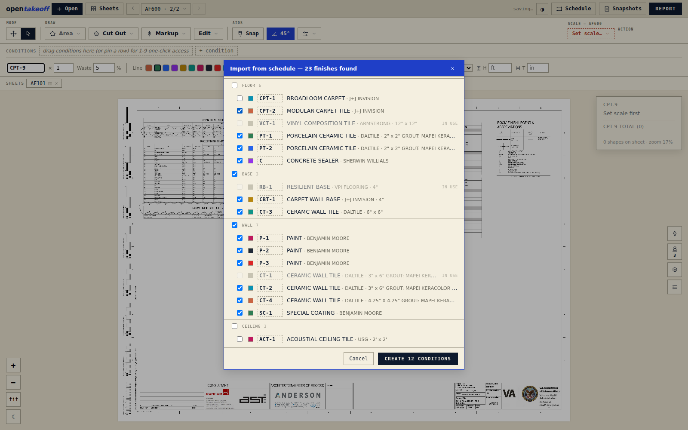

# OpenTakeoff — The User Manual

OpenTakeoff is a takeoff canvas that runs in your browser. Open a plan, set the scale, trace the finishes — or let an AI agent stage the tracing while you keep the accept button — and walk away with a priced-out quantity report, a materials buy list, and a marked set you can send to a GC. Everything happens on your machine: no account, no upload, no install.

This manual takes you from a blank browser tab to a finished, exported takeoff, and covers every shipped feature along the way. Shortcuts appear inline as you meet each tool; the complete table is in [§15](#15-keyboard-reference).

**Contents**

1. [Five minutes to a takeoff](#1-five-minutes-to-a-takeoff)
2. [Opening plans & moving around](#2-opening-plans--moving-around)
3. [Scale — set it first](#3-scale--set-it-first)
4. [Conditions — your finishes](#4-conditions--your-finishes)
5. [The measuring tools](#5-the-measuring-tools)
6. [One-Click Area](#6-one-click-area)
7. [Selecting & editing shapes](#7-selecting--editing-shapes)
8. [Undo & redo](#8-undo--redo)
9. [Markups, stamps & RFIs](#9-markups-stamps--rfis)
10. [The report & exports](#10-the-report--exports)
11. [Revisions](#11-revisions)
12. [Saving, your data & Contribute](#12-saving-your-data--contribute)
13. [The Agent panel](#13-the-agent-panel)
14. [AI settings & driving OpenTakeoff from an agent](#14-ai-settings--driving-opentakeoff-from-an-agent)
15. [Keyboard reference](#15-keyboard-reference)
16. [Troubleshooting](#16-troubleshooting)

---

## 1. Five minutes to a takeoff

The fastest way to learn the canvas is to run one takeoff end to end on the bundled plan.

1. **Load the sample.** On the opening screen, click **Load sample plan** — a real medical-center floor finish plan. (Your own plans: drag a PDF anywhere onto the page.)
2. **Accept the scale.** Open the **Set scale…** chip in the toolbar. The plan's drawn scale note has already been read off the sheet — click **Plan says 1/4″ = 1′-0″ — use it**. A calibrated ruler bar flashes on the sheet for a few seconds so you can eyeball that it's right (a door opening is about 3′).
3. **Pick a condition.** A fresh workspace ships with a starter set of flooring conditions — CPT-1, LVT-1, CT-1, and friends. Press `1` to arm the first (the number keys answer in list order until you pin your own palette), or open the **☰ Takeoffs** rail button and click one.
4. **One-Click the rooms.** Press `O`, then click inside a room. The room traces itself, wall to wall, as a dashed proposal. Click the next room, and the next. Press `⏎` to create them all.
5. **Read the report.** Open **Report** for the per-condition breakdown — SF, SY, waste-adjusted order quantities, and the materials buy list. Export **CSV**, **Excel**, or a **Marked set** PDF.

That's the whole loop: open → scale → condition → measure → report. Everything autosaves to your browser as you go — reload the tab and your takeoff is still there.

---

## 2. Opening plans & moving around

### What you can open

Drag onto the canvas (or click the **Open your plans** target on the empty screen):

- **PDF** plan sets — multi-page, multiple files at once.
- **Images** — scans, screenshots, photos of a sheet. They're wrapped into PDF pages in your browser.
- **`.zip` plan sets** — the whole download off a bid platform. Unzipped in the browser; every PDF inside opens. (Hostile-archive guards cap entry counts, sizes, and nesting, so a malformed zip fails cleanly instead of ballooning the tab.)

Nothing uploads anywhere. The file is read locally, rendered locally, and stored locally.

### The sheet gallery (`G`)

Press `G` (or click **Sheets** in the toolbar) for the visual gallery: one card per sheet, with its title-block sheet number, a thumbnail, and status badges — a level chip, **open** if it's already a tab, a shape count, and a scale status (**scale ✓** green, **plan: 1/4″ = 1′-0″** amber when a scale note was detected but not yet adopted, **no scale** red).

- **Open one sheet**: hover a card and hit **View**.
- **Open several**: click cards to select them — each gets a numbered badge, and that order is the left-to-right order. Then **Open N as tabs** or **Open N side-by-side** (side-by-side maxes at **4 sheets**; one pan/zoom moves the whole row).
- **Close a PDF**: hover the file's first card and hit **✕**. Takeoffs on its sheets are preserved and restore if you re-add the same file.
- `Esc` closes the gallery (when a sheet is open behind it).

### Tabs, groups, and Regroup

Open sheets ride a **Sheets** tab strip: click a tab to view it, **⊞** to put it side-by-side with the current sheet, **✕** to close the tab. The sheet chip's dropdown lists every page and file, and holds **Ungroup — back to one sheet** and **Regroup (N)** — one click to restore your last side-by-side composition after working sheets individually. Each sheet in a group keeps its own scale, takeoffs, and markups.

### Levels (multi-floor sets)

In the gallery, select sheets and hit **Assign level…** (`"L1"`, `"Level 2"`, `"Garage"` — empty clears). The gallery groups by level with unassigned sheets last, cards wear their level chip, and tabs plus the page picker carry the label. Levels save with the project.

### Pan & zoom

Panning is always at hand, whatever tool is armed:

- **Trackpad**: two-finger scroll pans both axes; pinch zooms.
- **Mouse**: a wheel notch zooms toward the cursor (~12% per notch, glided); `⇧`+wheel pans.
- **Any device**: middle-drag, right-drag, or hold `Space` and drag. The **Pan** tool (`P`) is there if you want it.
- **Select tool**: dragging open canvas pans — the instinct you brought from desktop takeoff tools just works.
- **Mid-measure**: a held click that moves becomes a pan instead of placing a point. Click-release places; press-drag travels.

### Rendering: crisp at any zoom

Past ~115% zoom the visible region re-renders straight from the PDF vectors at your current zoom, so fine callouts and hatching stay razor-sharp at any depth. Per sheet, the **Render & fill settings** menu (the sliders icon beside the 45° and Snap toggles) offers **Hi-Res render (this sheet)** — a higher base raster quality budget (~28 MP) for dense sheets. Hi-Res is a display setting, saved per sheet per browser; **quantities are never affected by render quality**.

### Dark view (☾)

The **☾** button in the zoom cluster inverts the sheet pixels themselves — a true negative print, white linework on black, not a CSS filter — with hatches retuned to stay legible. The setting persists per browser, and exports follow it: a dark canvas produces a dark Marked Set PDF.

---

## 3. Scale — set it first

Scale is the foundation. Every square foot on your report is pixels × scale², so a wrong scale is every number wrong at once. OpenTakeoff treats scale accordingly: it's **per sheet**, it's verified visually on every acceptance, and nothing prices without it.

### What refuses to work without a scale

Until a sheet has a scale, the Scale chip reads **Set scale…** in red, the live readout says **Set scale first**, and committing a measurement refuses with *"Set the scale for 〈sheet〉 first."* One-Click won't propose, and pasting a shape onto an unscaled sheet refuses too (paste re-prices on the target sheet). The one exception is **Count** — each (EA) quantities don't depend on scale, so counting works everywhere.

This is deliberate. A takeoff tool that silently measures in pixels produces confident-looking garbage; OpenTakeoff would rather stop you for five seconds.

### Adopting the plan's own note

When a sheet's title block states a scale, OpenTakeoff reads it as you open the sheet. The Scale menu then leads with **Plan says 1/4″ = 1′-0″ — use it** under the heading *From the plan*. **Hovering the item previews the calibrated guide bar on the sheet behind the menu** — sanity-check before you commit. If the sheet shows several different scales (details are often larger), the suggestion is marked **±** and the tooltip tells you to confirm against a known dimension; when the text shows several scales and no title-block note, nothing is suggested at all — ambiguity is not a suggestion.

### Standard scales

The Scale menu lists the standard architectural scales (1/16″ through 3″ = 1′-0″), engineering scales (1″ = 10′ through 1″ = 60′), and metric ratios (1:20, 1:25, 1:50, 1:75, 1:100, 1:125, 1:200, 1:250, 1:500). Both families are always listed. *Remembered per sheet* — because plan sets are never one uniform scale. In a side-by-side group, the Scale chip targets the sheet you last clicked.

### Calibrate from a known dimension

No usable note? **Calibrate two points…**: click both ends of something the drawing dimensions — the longest string you can find — then type the real length (feet in imperial, meters in metric) and **Apply**. `⌫` pops a misplaced click; both clicks must land on the same sheet.

### Check a dimension (`K`) — make it a habit

`K` is calibrate's read-only twin, for *verifying* a scale before you trace. Click both ends of a printed dimension string; the bar reads what that span **measures** at the current scale (the live cursor chip shows the running length while you pick the second point). Then type what the drawing **says** (`12.5`, `12'6`, `12' 6"`, `12-6`, and `6"` all parse), and a verdict chip grades the error:

- **Green**, within 1%: *matches — scale checks out*.
- **Amber**, within 5%: *off — re-check or recalibrate*.
- **Red**, past 5%: *wrong scale; recalibrate*.

One tap on **Recalibrate to this** turns your check into the calibration. Run a check on every new sheet before tracing — it's ten seconds against re-doing a takeoff.

### The guide bar

Every scale acceptance — standard pick, plan-says, calibration, or a check's recalibrate — drops an ephemeral **calibrated ruler bar** on the sheet: a round length with foot (or meter) ticks and the caption *a door opening is about 3′ — if this bar looks wildly off, the scale is wrong*. It dismisses itself after 8 seconds or on your next action, and it's never saved. A 2×-off scale is visually obvious before anything gets traced.

### Rescaling a measured sheet

Change a sheet's scale after tracing and **every shape on that sheet re-prices to the new scale immediately** (counts keep their EA). The Scale menu then offers **Revert scale (was …)** — one step back to the scale the rescale replaced, re-pricing again; the revert is itself revertible. One thing to know: a rescale **clears the undo/redo stack**, because every recorded step froze its quantities at the old scale and undoing one afterwards would resurrect stale numbers.

If the scale you set disagrees with the note printed on the sheet, the chip warns you: **≠ 1/4″ = 1′-0″** in amber, with the tooltip *"You set X, but the plan notes Y — double-check before tracing."*

### Metric

The **`ft` / `m`** toggle beside the Scale chip switches the whole display layer: readouts, shape chips, panels, the Report, CSV, and the Marked Set legend read in m² / m (the SY column retires), and Calibrate takes meters. It's display only — takeoffs are stored unit-agnostically, so flipping it never changes a measurement. Supporting-material coverage rates stay as entered.

---

## 4. Conditions — your finishes

A **condition** is one finish — `LVT-1`, `CPT-2`, `RB-1` — and it's what every measurement commits into. A fresh workspace seeds a flooring starter set (CPT-1, BRD-1, LVT-1, WD-1, VCT-1, SV-1, CT-1, RB-1, TR-1), several with real supporting materials already attached — CT-1 arrives with thinset and a grout line whose coverage derives from tile geometry.

### Creating, editing, deleting

**+ condition** (in the Takeoffs panel footer, the top-bar palette band, or the compact strip) prompts for a finish tag and mints the condition with an auto-rotated color and hatch. The active condition's editor appears inline — in the panel's active row and in the top-bar band:

- **Finish tag** — rename in place.
- **× multiplier** — measure one identical unit, count it N times. Shows as ×N everywhere.
- **Waste %** — the allowance the Report adds on top of the measured quantity. Per condition, matched to the install: ~8% straight-lay LVP, ~15% diagonal, ~20% herringbone.
- **Line** color, **Fill** color (or **No fill**), and the **hatch pattern** — a picker grid of CAD hatches (plank, herringbone, tile, terrazzo…) that names the pattern under your cursor, so the canvas reads like the real drawing.
- **Line style** — the outline dash for this finish's floor and linear takeoffs, on canvas and in the Marked Set.
- **H** (height, ft) — the default for **new** wall traces (Surface Area SF = LF × H) and the vertical-SF display. Existing walls keep the height they were drawn at — select a wall to change just that one (§5).
- **T** (thickness, in) — a Linear run with thickness also computes border/feature-strip SF = LF × T⁄12. Changing it re-flows existing runs.

**Delete** (the row's ✕) asks first when the condition owns shapes — *"Delete 〈TAG〉 and its N takeoff(s)? This can't be undone."* — and means it: the cascade is deliberately outside the undo stack (§8).

There's no per-condition duplicate; the Library fills that role — read on.

### The quick-access palette and `1`–`9`

The band under the toolbar is your working set: **pin** a condition there (the pushpin on its panel row) or **drag** a row onto the band. Palette chips wear cobalt number badges — **that number is the hotkey**: `1`–`9` arm palette conditions in palette order (drag chips to reorder; the numbers follow). Up to 9 pin, mapping 1:1 onto the digits; with nothing pinned, the digits fall back to list order. Single-click a chip to arm it; double-click to open its row in the panel. A digit press only ever arms — it never reassigns a selected shape (§7).

### The Takeoffs panel

The **☰ Takeoffs** rail button docks the panel (it starts collapsed; the palette band is the primary surface). Four tabs:

- **Takeoffs** — every condition with live totals for the open sheets (`SF · SF wall · LF · EA`), a shape count, a **⌖** that zooms the canvas to the condition's takeoffs (double-clicking the row does the same), the Supporting Materials button, the pin, and delete. Above the list: a filter box, **A→Z** natural sort and **≡ grp** tag-family grouping (views only — hotkey numbering never changes). **⌘-click / ⇧-click** rows to bulk-select conditions, then set waste or line color on all of them, or bulk-delete.
- **Library** — reusable condition templates, shared across every plan in this browser. **+ save 〈tag〉 to the library** snapshots the active condition (appearance, waste, H/T, materials); **Apply** adds it to any project as a fresh condition. A fresh workspace seeds from this library — tune your house conditions once and every new job starts with them.
- **Materials** — a browser-wide materials library. Attaching a library material to a condition copies its values and keeps a link (⛓); library edits reach linked lines only when you push them, and overridden fields show amber with a per-field ↺ revert.
- **Columns** — project-wide **custom columns** (e.g. *CSI Division*) that classify conditions for report grouping and exports, and the **shape-label vocabulary** (§7).

### Supporting materials — the buy list's source

Open **Supporting Materials** on a condition. Two free-text fields sit above the material list — **Labor** (glue-down, float, nail-down, …) and **Subfloor** (ply, concrete slab, OSB, …) — fill in whatever your bid needs; both round-trip through saved templates and show up as their own Report/CSV/XLSX columns once you've typed a value anywhere in the project.

Below that, list what actually goes on the order: adhesive, sealer, polyurethane, thinset, grout, cove-base adhesive. Each line carries:

- a **coverage rate** — *1 unit per N* — and a **basis**: floor SF, linear LF, or each;
- a **round up** flag (on by default — you buy whole buckets and bags);
- a **preset picker** for adhesive and mortar lines: real trowel-notch and roller spread rates (PSA rollers at 300 SF/gal down to coarse wood notches at 40 SF/gal; mortar trowels from 90 to 30 SF per 50-lb bag). Generic industry-typical values — always verify against the product data sheet;
- for **grout** lines, an inline **calculator**: enter tile L × W × thickness, joint width (1/32″–1/2″), and bag weight, and the SF/bag rate derives itself, writing its work into the note (`12×24×3/8″ @ 1/8″ · 25 lb`);
- a **note** field for coats, notch, anything the order needs to remember.

Order quantity = measured basis ÷ coverage, **rounded up to whole units**. The Report sums every condition's lines into one combined buy list (§10).

### Import from schedule



Why type conditions the architect already tabulated? Arm **Schedule** in the toolbar and click two corners around the finish schedule on the sheet. The table parses in the browser, and a verify dialog lists every finish it found — grouped Floor / Base / Wall / Transition / Ceiling / Other, each row with the code (click to fix it), description, and flags (**in use**, **duplicate**, **needs a code**). Ceiling and other rows arrive unchecked; you approve what becomes conditions. Each created condition gets category-appropriate color, hatch, and default waste (floor 5%, base and wall 10%), and the schedule's product data (manufacturer, style, color, size) rides along as read-only spec fields that surface as the Report's *Product spec (imported)* columns.

On scanned pages there's no text to parse; team builds with the optional AI backend can read the schedule from pixels — the message tells you when that's what's needed.

---

## 5. The measuring tools

Every measuring tool commits into the active condition and refuses politely without a scale (§3). Trace with click-release; press-drag pans. `⏎` or double-click finishes a shape; `⌫` pops the last point; `Esc` abandons the trace; `⌘Z` mid-trace also pops the last point.

### The aim cursor

On the canvas the crosshair **is** the cursor: the OS pointer hides in draw modes, full-page cobalt hairlines meet at a star, and in-progress work draws in the instrument's own cobalt — committed shapes wear their condition's color. A chip by the cursor carries the live readout for whatever you're doing.

### Area (`A`)

Click vertex by vertex around the space; `⏎`, double-click, or the **Finish** button closes it at three or more points. The live readout shows the running segment length while you trace, and the committed shape reads SF, SY, and perimeter LF.

### Rectangle (`R`)

Two clicks: one corner, then the opposite corner. Between them the cursor chip reads live — `12′ 6″ × 10′ 0″ · 125 SF · 13.9 SY` — and turns **amber the moment a side reaches 12′**: broadloom roll width, a seam falls here. Watch the chip and you're seam-planning while you measure.

### Linear (`L`)

An open run, two or more points → LF. If the condition carries a **thickness**, the run also yields border SF (LF × thickness ÷ 12) — feature strips, borders, transitions. The live chip reads the running segment length, amber at 12′.

### Curved Line (`Q`)

Like Linear, but the line bends smoothly through your clicks — radius walls, curved transitions, winding corridors. Click a few points along the curve, **⏎** or double-click finishes; drag any point later and the curve re-smooths through it. LF comes from the true curved length (a spline through your points, not the chords between them), and a condition **thickness** yields border SF the same way Linear's does.

### Surface Area (`S`)

Trace a wall run in plan; wall SF = traced LF × the condition's **height**. There's no prompt mid-trace — the height comes from the condition, and the tool refuses if it has none: *"Set a height for 〈TAG〉 (H in the condition editor) — Surface Area = traced LF × height."* After commit, select the wall and the readout offers a **this wall** height override (with a ↺ reset) — full-height tile here, 4-ft wainscot there, same condition. A wall keeps the height it was drawn at even if you later change the condition's default, and an explicit override is honored outright — even `0`.

### Count (`C`)

One click, one marker, one EA. Counts commit immediately on click and are the one measurement that works without a scale.

### Cut Out — deducts (`D`, `⇧D`)

The **Cut Out** menu subtracts voids: **Deduct shape** (`D`) traces a polygon, **Deduct rectangle** (`⇧D`) boxes one. A deduct belongs to the active condition and subtracts its SF from that condition's floor total — columns, shafts, casework, anything inside a traced area that doesn't get flooring. Deducts draw in dashed red and carry their negative sign into the report's shape audit.

### Zone check

**Zone** (toolbar button; no hotkey) answers "what's in this wing?" without touching the takeoff. Trace a region the way you'd trace an area — an apartment, a phase — and close it with `⏎`, double-click, or **Finish**. A panel lists every condition whose shapes sit inside, with quantities **and its supporting materials scaled to the zone**, computed by the same rules as the Report. Shapes count by their center point, same sheet only, and counted shapes glow cobalt so inclusion is visible. It's a reading, not a takeoff: nothing is saved, redrawing replaces the zone, and `Esc` or leaving the tool clears it.

### The 45°/90° angle lock

With the **45°** toggle on (it's on by default), the segment you're drawing locks to the 45° family — 0°, 45°, 90°, 135° across the sheet — whenever the cursor comes within ~4° of an axis. The lock is quiet: the star swells, the preview line thickens, and the chip reads the locked angle plus the live segment length. **The click commits the exactly-on-axis point**, so walls come out dead square. Hold `⇧` to force the lock at any cursor angle; toggle **45°** off for free-angle tracing.

### Snap (beta)

The **Snap** toggle pulls your cursor onto true PDF endpoints — real corners extracted from the drawing's own vectors. When a snap engages, the chip reads `snap`, and an endpoint snap always beats the angle lock: corners win over axes. Off by default; scans have no vector endpoints, so Snap has nothing to grab there.

### The live readout

The top-right readout tracks the armed tool: totals for the tracing tools, `W × H · SF · SY` for Rectangle, wall SF at the condition height for Surface Area, and running One-Click selection totals. Any run or side that reaches **12′ turns the chip amber** — the roll-width warning rides every tool that measures a length.

---

## 6. One-Click Area


One-Click Area (`O`) is the fastest way to measure a room: click inside it, and the linework bounds a flood fill, the boundary traces itself, and the vertices snap to true corners. What comes back is a **proposal** — dashed, editable, uncommitted — and nothing enters your takeoff until you create it. Review is the point: the engine does the tracing, you keep the judgment.

### The flow

1. Arm `O` and click inside a room. The traced region appears dashed with a star at your seed point.
2. Keep clicking — each click adds a space to the selection (the readout totals them live). **`⌥`-click carves a cutout**: an enclosed area *inside* an already-selected space — a column, a shaft — that will commit as a deduct.
3. **Create** with `⏎`, a double-click, or the **Create (N)** toolbar button. Every space commits as a shape on the active condition; cutouts commit as deducts. The toast confirms: *"Created N takeoff(s) — 〈SF〉 〈TAG〉. Click the next room."*

`⌫` walks the selection back (last region drops), and `Esc` discards it all. The readout keeps the crib sheet on screen: *click adds a space · ⌥-click carves a cutout · ⏎ Create · ⌫ undo · Esc cancel*.

### Review before Create

Hover a proposed region and its grips reveal:

- **Drag a corner** to move it (it snaps to true drawing endpoints as you drag).
- **Click a corner** to select it — `⌫` then deletes just that point (a space keeps a 3-point floor).
- **Drag an edge grip** to move the whole line — both endpoints together.
- **`⇧`-click an edge** to insert a new anchor at its midpoint and drag it out in the same gesture.

Edits you make before Create ride into the shape's provenance as *corrected before create*, with the machine's original ring frozen alongside — the takeoff remembers what the engine proposed and what you fixed.

### Hatched rooms, and when it refuses

Hatch and poché don't fool the fill: tile grids, plank lines, and section fills are classified as *pattern*, not wall, so a click inside a fully hatched room still traces to the real walls. The escalation is conservative — a strict pass runs first, the hatch-transparent retry only engages when the strict pass comes back trapped, and a retry that balloons past sanity is discarded for the strict result. **A misread can never make the result worse than the strict fill.**

When One-Click refuses, it says why, and the answer is always actionable:

- *"That space isn't enclosed on the plan linework — the fill spilled."* — there's a genuine gap (an open doorway, a break in the wall). Click a more enclosed spot, or trace it with Area (`A`). A hatched room with a real door gap **refuses rather than guessing** — that's deliberate.
- *"Landed in dense linework (hatching/text)."* — the click hit a text block or hatching too dense to read as a room. Zoom in and click an open spot, or use Area.

### Fill sensitivity

The **Fill** slider lives in the **Render & fill settings** menu (sliders icon), with three notches:

- **Strict** — stop at the linework, no hatch crossing (the original behavior).
- **Balanced** (default) — recover hatch-lined rooms to the walls.
- **Aggressive** — cross more pattern and tolerate more growth.

Lower it if fills spill; raise it if hatched rooms come up short. The setting is per browser, and a non-default sensitivity is recorded on the shapes it produced.

### Scanned plans

A scanned sheet has no vector linework, so the engine reads the rendered pixels instead: adaptive thresholding (shaded rooms and uneven scans read correctly), polarity detection (blueprint negatives invert), and a gap-bridging pass for faded ink — then the same flood-and-trace machinery runs on the scan ink. Raster results skip corner snapping (a scan has no true endpoints) and the readout badges them plainly: ***Traced from scan pixels — verify edges before Create.*** Nudge the grips where the scan is soft, then create. The sensitivity slider doesn't apply on scans, and the refusal messages name the scan honestly (*"the fill escaped through a gap — faded line or open doorway"*).

### The provenance receipt

Every shape One-Click creates records how it was made: the method, the seed point you clicked, whether hatch filtering engaged, whether it was traced from scan pixels, any non-default fill sensitivity, and — if you adjusted the proposal — the machine's original ring frozen next to your final one. You'll never need to think about this while measuring; it's what makes the takeoff auditable later, and it's the backbone of the optional Contribute flow (§12).

---

## 7. Selecting & editing shapes

Arm **Select** (`V`) and click a shape. Selection is one shape at a time on the canvas, and the same edit grammar as One-Click proposals applies:

- **Drag a corner** to move that vertex (it snaps to true drawing endpoints). **Click a corner first** to select it — `⌫` then deletes just that vertex. A closed shape keeps at least 3 points, a run keeps 2; at the floor, the message tells you *"⌫ again deletes the whole shape."*
- **Drag an edge grip** (mid-edge) to move the whole line — both endpoints together.
- **`⇧`-click an edge** to insert a new anchor at its exact midpoint and drag it out in one gesture.
- **Drag the body** to move the whole shape. Moving never re-prices — translation doesn't change area.
- **`⌫` with nothing else picked** deletes the shape.

Quantities recompute live as you edit. Every completed gesture is one undo step (a drag that ends where it started records nothing), and editing a machine-made shape — One-Click or agent — grades it as *corrected* in its provenance, with the machine's original boundary frozen the first time you touch it. The **Edit** menu in the toolbar carries the same verbs — Copy, Paste, Duplicate, **Flip Horizontal**, **Flip Vertical**, Delete selected, Undo last point, Undo last shape, Redo — with their shortcuts beside them. Flip mirrors the selected shape about its own center (an isometry — SF/LF never change); it has no keyboard shortcut, only the menu.

### Copy, paste, duplicate

- `⌘C` copies the selected shape — the toast reminds you: *"Copied — ⌘V pastes onto the sheet under your cursor."*
- `⌘V` pastes **onto the sheet you're hovering** — cross-sheet included. A same-sheet paste lands slightly offset so you can see it; a cross-sheet paste keeps the same relative spot and **re-prices against the target sheet's own scale** — never carrying stale square feet (an unscaled target refuses).
- `⌘D` duplicates in place.
- A wall's height override rides along with copies — even an explicit 0. Pasted clones carry their source's lineage, marked as copies in provenance.

### Reassigning a shape's condition

With a shape selected, click a condition **panel row, strip chip, or palette chip** — each shows the reassign affordance when a shape is selected — and the shape moves to that finish, quantities and all. The number keys never reassign: a digit press arms the condition without touching your selection, so a stray `3` can't silently move quantities. Reassigning is one undo step.

### Shape labels — phases and areas

Labels answer "which part of the job is this?" without more conditions: *Phase 1*, *East Wing*, *Alt-2*. The vocabulary lives in the Takeoffs panel's **Columns** tab (add, rename — labeled shapes follow, remove — shapes keep their value); once any labels exist, a **Label** cluster appears in the toolbar:

- Its caption shows the **active label** — every new trace you commit gets it. Set it to *Phase 1*, trace the phase, set it to *Phase 2*, keep going.
- With Select armed and a shape selected, the same dropdown shows **that shape's** label and re-labels it.

Labels drive the Report's *Group: Label* mode and its by-label export sections (§10). Label changes are undoable, and they never mark a shape as edited — classification is not correction.

---

## 8. Undo & redo

`⌘Z` undoes, `⇧⌘Z` redoes — real undo, over a stack of up to 100 steps.

**What's a step.** Creating shapes (a whole One-Click *Create* batch or an agent *Accept* batch is **one** step), every completed edit gesture (a vertex drag, an edge drag, a body move, a vertex delete), a reassign, a label change, a delete, a paste, a duplicate. A drag that ends where it started records nothing — zero motion is not an edit.

**What undo restores.** Everything, exactly: geometry, quantities, stacking order, and provenance. Undoing an edit removes the *edited* flag it stamped; undoing a delete resurrects the shapes byte-for-byte at their original positions in the stack. Redo replays the step; making any new edit discards the redone future, as you'd expect.

**Mid-draw, `⌘Z` pops points.** While a trace is in progress, `⌘Z` removes the last placed point (same as `⌫`) — the command stack only engages when nothing is mid-draw.

**What's deliberately outside the stack:**

- **Deleting a condition.** The confirm says *"This can't be undone"* and means it: the cascade delete of its shapes doesn't record. A condition delete is a decision about the takeoff's structure, not a gesture (Revisions are your parachute — §11).
- **Rescaling a sheet** and **restoring a revision** both **reset the stack**. Every recorded step froze quantities at the old scale (or the old timeline); undoing across that boundary would resurrect stale numbers, so the boundary clears it. A restore always banks the live takeoff first, so nothing is lost — it's just not on the `⌘Z` stack.
- **Markups and condition edits.** The undo stack is for measured shapes. Moving a cloud or changing a waste % is a plain edit — change it back by hand.

One more distinction: **Undo last shape** (Edit menu) and `⌫`-with-nothing-in-progress are not `⌘Z` — they *delete the newest shape* on the sheets you're viewing. That delete records normally, so `⌘Z` can bring the shape back.

---

## 9. Markups, stamps & RFIs

The markup layer is communication, never quantity: clouds, callouts, notes, highlighter ink, and stamps live on a separate layer the totals never count. The left dock (rail buttons on the canvas's right edge) carries three tabs — **Markups**, **Stamps**, **RFIs**.

### The markup tools

The **Markup** menu holds five tools:

- **Highlighter** (`H`) — freehand marker ink. Press and **drag to paint**, stroke after stroke, no dialog between them. While it's armed, a style popover hangs under the menu: five inks (yellow default), **F / M / B** tip sizes, and a **chisel or round** nib — remembered per browser. Because press-drag paints, press-drag panning is off while the highlighter is armed; pan with `Space`-drag, middle-drag, or right-drag. Strokes stick to their sheet, scale like real ink, and are real objects: with Select, click one (it glows), drag to move it, `⌫` deletes it.
- **Revision cloud** — two corner clicks; the cloud lands immediately, then an optional note editor opens (`Esc` keeps the cloud, skips the note). Clouds can carry a **Rev △** revision number from the panel.
- **Callout** — first click is the *target* (the thing you're pointing at), second is the label spot, then type the text.
- **Text note** — one click, type in place. Empty text doesn't commit.
- **Highlight box** — two corners, done.

Every markup is editable after the fact: with Select, click to pick it, drag to move it, **double-click to edit its text in place**. The Markups panel lists them all with an edit pencil, a **color** row (auto or any palette color), **line style** and **weight** controls, and a **Hide layer / Show layer** toggle for the whole layer. (Markup moves are plain edits, not undo steps — the `⌘Z` stack is for measured shapes.)

### Stamps

A **stamp** is a reusable annotation — one or several markup elements saved as a named group and placed with a click. The library seeds with flooring basics (**Plank / tile direction**, **Seam direction**, **Pattern origin**) and is browser-global: build it once, use it on every plan.

Hit **Place** on a stamp and the canvas arms it: *click the plan to place it* — every click drops a copy until `Esc` or another tool. Placed stamps are normal, editable markups. Make your own: select any markup and **Save selected markup as stamp**, or **Import** an `.svg` vector symbol (or a stamp-library `.json`); **Export** shares your library the same way.

### RFIs

The **RFI register** turns a markup into a tracked question. In the Markups panel, every cloud, callout, or note carries **Raise RFI** (or **Link existing…** to attach it to an open one). Raising mints the next number — `RFI-001`, `RFI-002`, … — seeds the subject from the markup's text, and opens the register.

Each RFI carries: subject, question, **status** (Open / Answered / Closed / Void), **priority** (low / normal / high), **ball in court** (*Architect / GC…*), opened date, **cost impact** and **schedule impact** flags, and a response — the response date auto-stamps when the status turns Answered. Linked-markup chips fly you to the markup on its sheet; one RFI can link many markups. Deleting an RFI keeps the markups, minus the link.

RFIs export as **RFI CSV** and **RFI JSON** from the Report, and they ride the Marked Set PDF: linked markups get an on-sheet RFI-number marker and the set gains an **RFI schedule** page. An RFI-only project — questions before quantities — still exports a marked set.

---

## 10. The report & exports


Open **Report** for the whole takeoff on one page: a per-condition table, the supporting-materials buy list, per-sheet base quantities, and your markups noted — with a project-name field and a print masthead up top (client, reference, date, prepared-by, and an optional trade-name identity so the output brands as your company).

### The numbers, honestly

- **Measured vs. w/Waste.** Waste lives only in the w/Waste column: *SF w/Waste = measured × (1 + waste %)*. The measured quantity is never inflated, so your takeoff and your buy list stay honest about which is which. Waste applies to SF and LF, never EA.
- **SY** = w/Waste SF ÷ 9.
- **Multipliers** show as ×N beside the finish tag and multiply every quantity.
- **Buy list**: each material's quantity = measured basis (floor SF / linear LF / each) ÷ its coverage rate, **rounded up to whole units** — the number you order, not a theoretical gallon and a half. The combined list sums same-name materials after per-condition rounding.
- The footer says it plainly: *Quantities derived from drawings at stated scales; verify in field.*

### Columns, grouping, templates, theme

- **Columns** — choose what the table (and the CSV) shows. Defaults: Finish, Shapes, Floor SF, Wall SF, Border SF, LF, EA, Waste, SF w/Waste, SY w/Waste. Opt-ins: Total SF, Waste SF, Waste LF, Perimeter LF (reference only — includes openings, never totaled). Custom condition columns, imported product-spec columns (manufacturer, style, color, size, description — from a schedule import), and Labor Type / Subfloor Type (typed into a condition's Supporting Materials panel) appear once they exist. **Labor view** switches to a no-waste actuals set (Total SF in, SF/SY w/Waste out) for tying quantities to labor — attach your own rates externally.
- **Group** — break the table into sections with subtotals: by **Sheet**, by **Label** (once shapes carry labels), or by any custom column. Grouping by a column always carries that column into the CSV.
- **Templates** — save a column-plus-grouping layout by name and recall it on this device. Signed in on a team build, **Push to Drive / Load from Drive** carries templates across your own devices — Load only adds what this device doesn't have; it never overwrites a same-name template.
- **Theme** — import a design-token file (a `tokens.json`) to reskin the report's palette and fonts for output. **Reset** returns the house style.

### Exports

| Export | What you get |
|---|---|
| **CSV** | The condition table, exactly the columns you're showing. |
| **Excel** | A real workbook — **Summary**, **By sheet**, **Materials**, **Shapes** (the audit trail; deducts carry their sign). Full-precision cells; formula-shaped names stay inert text. |
| **JSON** | The full structured report — works markups-only and RFI-only too. |
| **Shapes CSV / JSON** | Per-shape measured quantities — no multiplier, no waste; the audit layer. |
| **Print** | The report through your browser's print dialog. |
| **Marked set** | A distribution-ready PDF built in your browser: every sheet that carries takeoffs or markups, the work burned in as drawn — condition colors, hatches, quantity chips, count markers, markups (toggleable) — behind a legend cover with net totals, w/Waste quantities, and a by-sheet breakdown. Exports in your current view: dark canvas → dark PDF. Send it to a GC who will never install anything. |
| **RFI CSV / JSON** | The RFI register (appears once RFIs exist). |

**Contribute** also lives here — covered with the rest of your data in §12.

---

## 11. Revisions

Addenda happen. **Revisions** (the clock icon on the rail) makes them data instead of archaeology.

- **Save** the current takeoff — conditions, shapes, markups — as a named revision (the name defaults to *Rev N — date*). Do it at every bid revision, and before anything risky.
- **Compare** any revision against the live takeoff or against another revision. The diff reads as **quantity deltas**: per condition (measured and ordered), per sheet (base quantities), and on the buy list, with added / removed / changed / unchanged status chips and an **Export compare CSV**. The headline gives you the one number first: ordered SF A → B, and how many conditions moved.
- **Restore** is never a one-way door: it banks the live takeoff as *Auto-backup before restore* first, then loads the revision. (It does reset the undo stack — §8.)

**Honest limits.** The compare is deliberately **quantity-level, not geometric**: it won't show you *which wall moved*, only which condition's numbers moved, on which sheet, by how much. Sub-display wobble (re-trace drift below 0.05 SF, or below half an EA) reads as unchanged, so a re-traced room that lands on the same number doesn't cry wolf. Conditions pair by identity first and finish tag second, so deleting and recreating `CPT-1` diffs as the same condition, not a remove-plus-add.

---

## 12. Saving, your data & Contribute

### Autosave, locally

Everything — drawings, scales, conditions, markups, RFIs, levels, tabs — autosaves to **this browser** (IndexedDB + localStorage) about a second after every change; the toolbar ticks *saving… / saved ✓*. Reload, close the tab, come back tomorrow: it's there.

**"Client-only" means exactly this:** in the default build there is no server in the loop. Your PDFs are rendered and stored in your browser; your takeoff never leaves your machine; there's no account and no telemetry. The flip side: storage is **per browser, per origin** — a different browser profile, a different machine, even a different `localhost` port is a fresh, empty workspace. Clearing site data clears your work (save revisions and exports first; the browser's storage is the only copy).

If a saved project fails to load, autosave **pauses itself** and a banner says so — a load failure never overwrites your saved work with an empty canvas. And if OpenTakeoff updates in another tab, the stale tab asks for a reload instead of writing over the newer one.

### Optional: projects on Drive

Team deployments can wire a Google Drive "Projects" root. Then a **project is a Drive folder**: sign in from the opening screen, pick the folder, and the plan PDFs live in it while OpenTakeoff keeps its own sidecars (the takeoff JSON and the working-set manifest) in a hidden `.opentakeoff` subfolder. The gallery grows a **Browse Drive** mode that lists the folder's PDFs — nothing downloads until you add it, so spec books and as-builts stay unopened. Revision snapshots stay in your browser but scope per project; condition and material libraries, stamps, and report preferences stay local to your browser either way. Run OpenTakeoff without signing in and none of this exists.

### Contribute — what's sent, what never is

Every finished takeoff is a set of expert decisions: *this* region is *this* finish at *this* waste. The **Contribute** button in the Report lets you donate that — and only that — to an open flooring model, or bank it into a corpus you own. It's a button, not a background process: **nothing is ever sent until you click it**, and a build with no endpoint configured can't send at all.

What a contribution contains, in plain language:

- your **condition labels** (the finish tags and their hatch, waste %, multiplier),
- each shape's **role and quantities** (SF / LF / EA) and its **geometry as a pure shape** — normalized 0-to-1 against the sheet, so it carries no scale and no location,
- and each shape's **provenance**: the app remembers whether a machine drew it (One-Click, the agent) and whether you fixed it — and sends that memory, including the machine's original boundary next to your corrected one. That pair is exactly what a takeoff model learns from.

What is **never** sent — this list is normative, enforced by a whitelist in the payload builder, and specified field-by-field in [`CONTRIBUTION_SPEC.md`](CONTRIBUTION_SPEC.md):

- the PDF, or any rendered image of it;
- file names or sheet names (sheets go out as `sheet_1`, `sheet_2`, …);
- project, client, or customer names;
- markup text, or any text you typed on the plan;
- absolute coordinates;
- scale **values** — only the scale's *provenance* rides ("calibrated" vs. "detected" vs. "standard");
- edit timing of any kind beyond each shape's creation stamp.

One linkage is deliberate and disclosed: shapes carry **opaque, locally-minted IDs**, so re-contributing after an addendum supersedes rather than duplicates. The IDs contain nothing and reverse to nothing.

The modal asks for an optional credit line and an attestation that you have the right to share the data. To bank takeoffs into **your own** corpus instead, run the bundled capture server (`python3 capture/capture_server.py`) and point the app at it (`localStorage.opentakeoff_contribute_endpoint = "http://localhost:8787/contribute"`) — see [`capture/README.md`](../capture/README.md).

---

## 13. The Agent panel

The Agent panel is the newest way to run the engine: describe a takeoff in a sentence, and an AI model — **yours**, on your key, from your browser — works the sheet with the app's own tools and stages **dashed proposals you accept or reject**. It is a proposer, never a committer.

### What it is, structurally

Open it from the rail (the target icon: *Agent — describe a takeoff; it stages dashed proposals you accept or reject*). Type a goal — *"Take off the carpet per the finish schedule on this sheet"* — and hit **Run** (`⌘⏎`). The model runs a tool-use loop against a registry of the app's own deterministic tools:

- **`list_sheets`** — what's open, with sizes and scale status;
- **`read_sheet_text`** — the sheet's positioned text layer;
- **`read_schedule`** — the same finish-schedule parser you use from the toolbar;
- **`view_region`** — a rendered crop, for scans or ambiguity;
- **`one_click`** — the flood engine, probe-only: it returns the traced ring, it commits nothing;
- **`get_conditions` / `create_condition`** — your condition list (creation dedupes against existing tags);
- **`propose_shapes`** — stage proposals for your review.

**The model never invents geometry.** It can only propose rings the engine traced or coordinates grounded in what it read, and `propose_shapes` rejects anything uncited: *every proposal must cite evidence*. The run streams into the panel log — every tool call, every result, every refusal — capped at 24 steps, with a **■ Stop** button that halts it instantly.

### The scale gate holds

Agent tools refuse an uncalibrated sheet with the same discipline as everything else: *"Set the scale for 〈sheet〉 first — the agent never assumes a scale; ask the estimator to set it."* The agent proposes; it never assumes a scale, and it can't set one.

### Accept, correct, reject

Proposals land on the canvas as **dashed pencil outlines** with a seed star, and in the panel as rows with **evidence chips** — the schedule row it matched (`schedule CPT-1`), the text it matched, the seed it flooded from. Then it's your desk:

- **Accept**: click a proposal on the canvas, use the row's ✓, or **Accept all** / `⏎` for everything on the visible sheets. Accepting commits through the same command layer as your own work — origin *agent*, reviewed by you, the proposed ring frozen, the evidence attached. **A whole accepted batch is one `⌘Z`.**
- **Correct**: edit an accepted shape like any other (§7). Corrections grade in provenance exactly like One-Click corrections — machine ring frozen, your fix recorded.
- **Reject**: the row's ✕, or **Reject all**. Rejection is **local only** — dismissed geometry is discarded and never rides the contribution wire.

A proposal whose sheet you've since closed (or unscaled) is skipped at accept with a message telling you to open the sheet; nothing commits blind.

### Setup — bring your own key

The panel is honest when unconfigured: it explains itself and offers **AI settings…**. Configure an endpoint (OpenAI-style — most local runtimes speak it and need no key — or Anthropic-style), a vision-capable model id, and an optional key (§14). Unconfigured builds make zero AI network calls.

### The keyless demo

Want to see the loop without any AI account? The repo ships a deterministic mock:

```bash
node scripts/mock-agent-server.mjs        # listens on http://localhost:8787
```

Point AI settings at it — endpoint `http://localhost:8787`, API style **Anthropic-style**, model `mock`, any non-empty key — open the sample plan with its scale set, and Run. The script drives the real engines (real schedule parse, real one-click probes, real proposals) through a scripted conversation, ending with proposals staged for your review. (The capture server also defaults to port 8787 — if you run both, give one a different `PORT`.)

---

## 14. AI settings & driving OpenTakeoff from an agent

### AI settings (BYO everything)

**AI — bring your own key** (opened from the Agent panel) is the one configuration surface for the AI seam:

- **Endpoint** — a hosted API or a local runtime on your own machine (`http://localhost:1234`).
- **API style** — OpenAI-style (the default; most local runtimes) or Anthropic-style.
- **Model** — a vision-capable model id.
- **API key** — optional; local runtimes generally need none. Stored **in this browser's localStorage only** — anyone with access to this browser profile can read it, so use a key you can revoke. The endpoint must allow browser requests (CORS); local runtimes generally allow localhost.

What's sent, and only when you run an AI feature: the sheet region in question and the question — to *your* endpoint. Never the whole plan file, file names, project names, or your takeoff. No telemetry either way. Deployers can bake team defaults with `VITE_AI_ENDPOINT` / `VITE_AI_MODEL` / `VITE_AI_PROVIDER` — but never `VITE_AI_KEY` on a public deploy; the build inlines it.

### MCP — for agent users

The same engine speaks [MCP](https://modelcontextprotocol.io), one command away: `npx -y opentakeoff-mcp` (or the one-click `opentakeoff-mcp.mcpb` bundle for Claude Desktop). An MCP client gets ten tools — `load_plan`, `sheet_info`, `set_scale`, `one_click`, `measure_polygon`, `measure_line`, `takeoff_summary`, `export_takeoff`, `delete_shape`, `read_sheet_text` — plus browsable sheet resources, over the very same measuring engine, with the same scale gate and the same provenance receipts; `export_takeoff` emits the app's own save payload. Setup, the coordinate contract, and a full example transcript: [MCP.md](MCP.md) and [`mcp/README.md`](../mcp/README.md).

---

## 15. Keyboard reference

Every shortcut in the app, verified against the code. Letter keys are suppressed while you're typing in a field and while a toolbar menu is open. `Ctrl` stands in for `⌘` on Windows and Linux throughout.

### Tools

| Key | Tool |
|---|---|
| `O` | One-Click Area |
| `A` | Area |
| `R` | Rectangle |
| `L` | Linear |
| `Q` | Curved Line |
| `S` | Surface Area (walls) |
| `C` | Count |
| `D` | Deduct shape (Cut Out) |
| `⇧D` | Deduct rectangle |
| `H` | Highlighter |
| `K` | Check a dimension |
| `V` | Select |
| `P` | Pan |
| `G` | Sheet gallery |

### Conditions

| Key | Action |
|---|---|
| `1`–`9` | Arm condition N — palette order once you've pinned a palette, list order otherwise. Never reassigns a selected shape. |

### Drawing

| Key / action | Effect |
|---|---|
| Click (release without moving) | Place a point |
| Press-and-drag | Pan mid-measure (no point placed) |
| `⏎` / double-click | Finish the shape (areas/deducts/zone need ≥ 3 points; linear/surface ≥ 2). In One-Click: **Create** the selection. With agent proposals pending and nothing mid-draw: accept all visible. |
| `⌫` / `Delete` | Pop the last placed point — then, in order: delete the picked One-Click vertex → drop the last One-Click region → delete the picked shape vertex → delete the selected shape → delete the selected markup → pop a calibrate/check point |
| `⌘Z` | Mid-trace: pop the last point. Otherwise: **undo** |
| `⇧⌘Z` | Redo |
| `Esc` | Back out one level: clear the vertex pick first, then everything in progress (trace, proposal, calibration, check, selection, markup draft, armed stamp, zone) |
| Hold `⇧` | Force the 45° angle lock at any cursor angle |
| `⌥`-click (One-Click) | Carve a cutout inside a selected space |
| `⇧`-click an edge | Insert a vertex at the edge midpoint (selected shape or One-Click proposal) and drag it |

### Selected shape or markup (Select tool)

| Key / action | Action |
|---|---|
| `⌘C` | Copy the shape |
| `⌘V` | Paste under the cursor — lands on the sheet you're hovering |
| `⌘D` | Duplicate |
| `⌫` | Delete (a picked vertex first, else the shape or markup) |
| Double-click a markup | Edit its text in place |

### View & navigation

| Key / action | Effect |
|---|---|
| Scroll (mouse wheel) | Zoom toward the cursor |
| Two-finger trackpad scroll | Pan, both axes |
| Pinch / `Ctrl`+wheel | Zoom |
| `⇧`+wheel | Pan |
| Hold `Space` + drag | Pan (any tool) |
| Middle-drag / right-drag | Pan (any tool) |
| `Esc` (gallery open) | Close the gallery; in Browse Drive, back to the plan set |
| `Esc` (menu open) | Close the menu |

### In panels & fields

| Key | Action |
|---|---|
| `⌘⏎` | Run the agent (in the Agent panel's goal box) |
| `⏎` | Apply calibration (calibrate field) · grade the check (check field) · save (revision-name field) |

---

## 16. Troubleshooting

**A sheet renders blank or slow.** Big sheets rasterize on open — give it a beat. If linework goes soft mid-zoom, that's the detail view re-rendering; it sharpens when the gesture settles. For dense sheets, flip **Hi-Res render (this sheet)** in the Render & fill settings menu — display only, quantities unaffected. Side-by-side groups multiply the render load; work single-sheet on a struggling machine.

**One-Click refuses a room.** Read the message — it names the cause. *Fill spilled* = a real gap in the linework: click a more enclosed spot, or trace with Area (`A`). *Dense linework* = you hit text or heavy hatching: zoom in, click open floor. A hatched room that keeps coming up short wants a higher **Fill** sensitivity; fills that leak want it lower — or Strict. On scans, verify the badged edges before Create, and remember the sensitivity slider doesn't apply there.

**The numbers look wrong — everywhere.** That's a scale symptom, not a math symptom. Run **Check a dimension** (`K`) against a printed dimension string. If the verdict is red, **Recalibrate to this** — every shape on the sheet re-prices instantly (and the old scale sits in **Revert scale** if you change your mind). Remember scale is per sheet: a plan set is never one uniform scale.

**⌘Z won't bring something back.** Three known cases: condition deletes cascade their shapes outside the undo stack (deliberate — the confirm warned you); rescaling a sheet resets the stack; restoring a revision resets the stack (but banked your live takeoff first — check Revisions). The stack also caps at 100 steps, and markup moves aren't on it at all.

**"Where did my work go?"** Work lives in the browser that made it, per origin. Same machine, different browser (or profile, or port) = a different workspace. If a load ever fails, autosave pauses and a banner appears — reload the tab to retry; your saved takeoff is untouched. For anything you can't afford to lose, save a **Revision** and export the report; if the browser warns about storage space, delete old snapshots or unused PDFs.

**The Agent panel won't run.** It needs AI settings (endpoint + model; key optional) — the empty state links you there. Tools refusing with *"Set the scale…"* is the scale gate working: set the sheet's scale, run again. Proposals that won't accept usually sit on a sheet that's been closed since — open it and accept. `⏎` accepts only when nothing is mid-draw.

**Endpoint errors in the agent log.** *"Couldn't reach the endpoint — check the URL, and that it allows browser requests (CORS)"* means exactly that; local runtimes generally allow localhost. A run that stalls two minutes reports the timeout plainly — check the model is loaded.

**Browser support.** OpenTakeoff needs a current browser with IndexedDB and localStorage — recent Chromium-family, Firefox, and Safari releases all qualify. Private/incognito windows may cap or evict storage: fine for a look around, wrong for real work.

---

*OpenTakeoff is Apache-2.0 and the codebase is deliberately readable — when you outgrow the manual, [`FEATURES.md`](../FEATURES.md) maps every capability to its code.*
